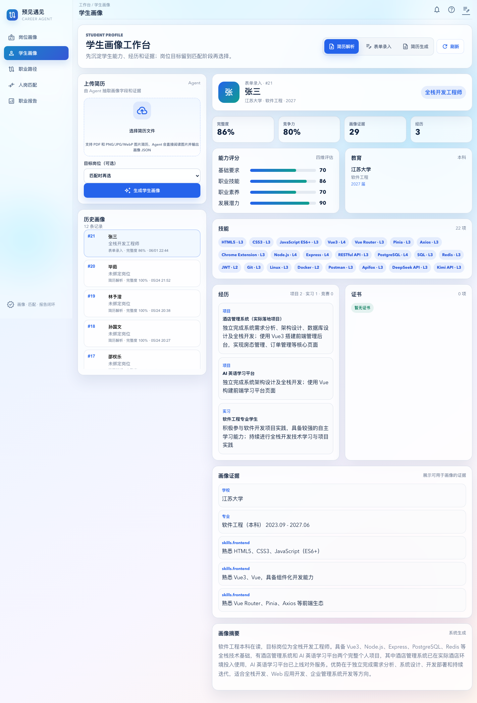
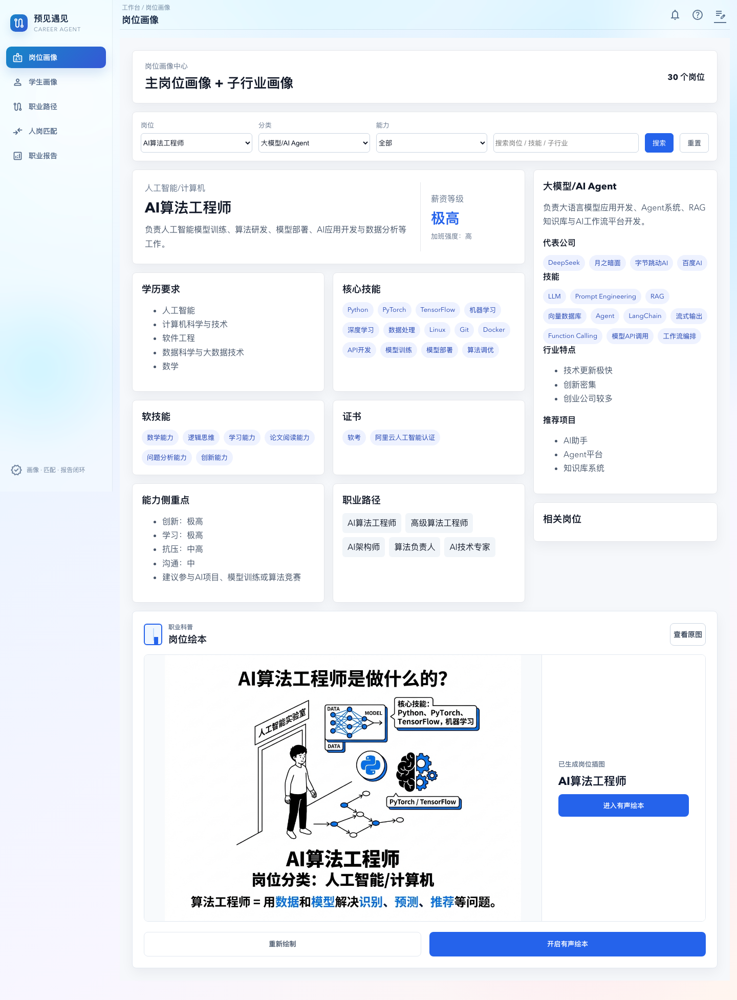
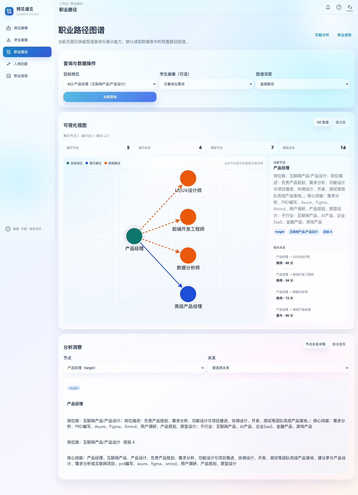
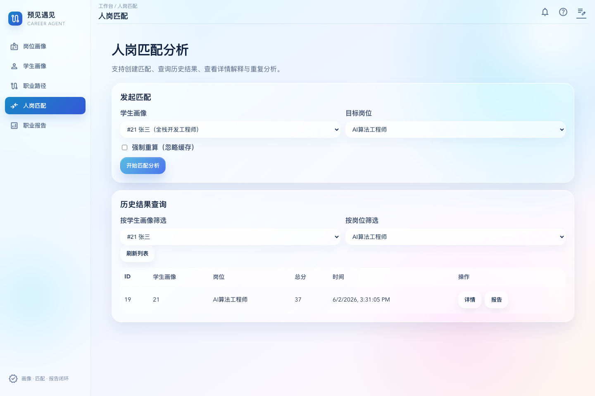
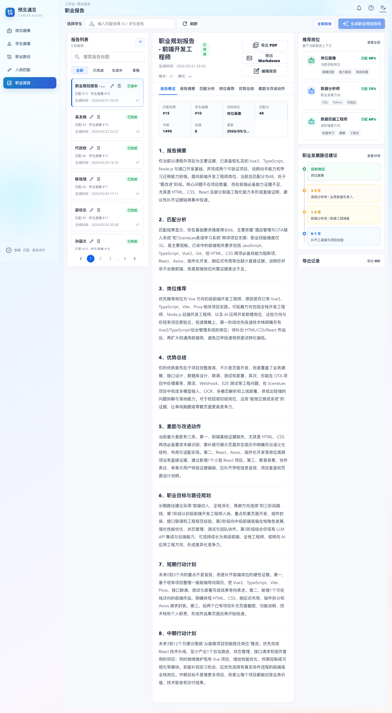

# 职涯星图：双画像驱动的大学生职业认知与规划智能体

面向大学生职业规划的 AI 工作台，覆盖“学生画像 -> 岗位画像 -> 人岗匹配 -> 职业路径 -> 职业报告”的完整流程。

项目中文名为“预见遇见”。它不是一个聊天壳，而是把简历解析、岗位画像、路径图谱、匹配评分、报告生成和导出组织成可复现的业务闭环。



## 核心能力

- 学生画像：支持简历上传解析、表单录入、结构化能力评分、经历与证据沉淀。
- 岗位画像：维护岗位画像库，展示岗位要求、技能栈、职业路径与画像详情。
- 人岗匹配：基于学生画像与岗位画像生成匹配结果，保留历史结果并支持重复分析。
- 职业路径：用 Neo4j 保存岗位关系图谱，展示晋升、换岗和技能迁移路径。
- 职业报告：基于匹配结果生成结构化职业规划报告，支持报告版本查询、编辑和导出记录。
- AI 中枢：通过 Pi Agent 封装工具调用，把简历解析、匹配、报告等能力接入真实模型运行时。

## 页面预览

### 岗位画像



### 职业路径图谱



### 人岗匹配



### 职业报告



## 技术栈

- Monorepo：npm workspaces
- 前端：Vue 3、TypeScript、Vite、Vue Router、Pinia、ECharts、AntV G6
- 后端：Node.js、Express、TypeScript、Zod、TypeBox
- 契约：OpenAPI、共享 TypeScript 类型，位于 `packages/contracts`
- 数据库：PostgreSQL、pgvector
- 图数据库：Neo4j
- AI 运行时：Pi SDK，可接入 Codex、Kimi、Moonshot 等 provider
- 部署：Docker Compose

## 项目结构

```text
career-agent/
├─ apps/
│  ├─ frontend/          # Vue 前端应用，按 app/features/shared 分层
│  └─ backend/           # Express 后端应用，按 modules/<domain> 分层
├─ packages/
│  └─ contracts/         # OpenAPI 与共享类型
├─ infra/                # Docker Compose、数据库初始化、备份恢复
├─ data/                 # 岗位原始数据、评测数据、处理后数据
├─ docs/                 # 项目文档、规范、设计说明
├─ scripts/              # 开发与数据脚本
└─ services/             # 外部集成服务占位
```

## 快速开始

### 1. 环境要求

- Node.js `22.20.x`
- npm
- Docker Desktop
- PostgreSQL/Neo4j 可以用仓库里的 Docker Compose 启动

仓库提供了 [`.nvmrc`](./.nvmrc) 和 [`.node-version`](./.node-version)：

```bash
nvm use
node -v
```

### 2. 安装依赖

```bash
npm install
```

### 3. 启动基础设施

开发模式只启动 PostgreSQL 和 Neo4j：

```bash
docker compose -f infra/docker-compose.yml up -d postgres neo4j
```

这个 compose 会把 PostgreSQL 映射到本机 `5433`，Neo4j 映射到 `7687` 和 `7474`。

### 4. 配置环境变量

复制后端环境变量模板：

```bash
cp apps/backend/.env.example apps/backend/.env
```

如果使用上面的开发 compose，请确认：

```env
PGHOST=127.0.0.1
PGPORT=5433
PGDATABASE=career_agent
PGUSER=career
PGPASSWORD=career_dev_password
NEO4J_URI=neo4j://127.0.0.1:7687
NEO4J_USERNAME=neo4j
NEO4J_PASSWORD=career_dev_password
```

前端默认请求 `http://127.0.0.1:8000`。如需显式配置：

```bash
cp apps/frontend/.env.example apps/frontend/.env
```

### 5. 启动开发服务

```bash
npm run dev
```

访问：

- 前端：`http://localhost:5173`
- 后端健康检查：`http://127.0.0.1:8000/healthz`
- Neo4j Browser：`http://localhost:7474`

## 演示数据

仓库包含演示数据备份：

```text
infra/backups/current/postgres.sql
infra/backups/current/neo4j-data.tar.gz
infra/backups/current/backend-storage.zip
```

完整恢复流程见 [docs/Docker-最小启动清单.md](./docs/Docker-最小启动清单.md)。恢复后会包含学生画像、岗位数据、匹配结果、职业报告、职业路径图谱和后端 storage 文件。

Windows Docker 完整说明见 [docs/Windows-Docker-部署说明.md](./docs/Windows-Docker-部署说明.md)。

## 常用命令

| 命令                                         | 作用                                                |
| -------------------------------------------- | --------------------------------------------------- |
| `npm run dev`                                | 同时启动前端和后端开发服务。                        |
| `npm run dev:backend`                        | 只启动后端服务，默认监听 `http://127.0.0.1:8000`。  |
| `npm run dev:frontend`                       | 只启动前端服务，默认监听 `http://localhost:5173`。  |
| `npm run type-check`                         | 执行 contracts、后端、前端 TypeScript 类型检查。    |
| `npm run build`                              | 构建 contracts、后端、前端。                        |
| `npm run format`                             | 使用 Prettier 格式化项目文件。                      |
| `npm run format:check`                       | 检查格式但不落盘。                                  |
| `npm run job-portraits:seed`                 | 将 `data/jobs/*.json` 的岗位画像导入数据库。        |
| `npm run knowledge:init`                     | 初始化知识库相关数据库结构。                        |
| `npm run knowledge:index:jobs`               | 将岗位数据索引到业务知识库命名空间。                |
| `npm run knowledge:eval`                     | 执行知识检索基线评测。                              |
| `npm run agent:auth -- status`               | 查看当前 Pi Agent 配置目录、模型和已登录 provider。 |
| `npm run agent:auth -- list`                 | 查看 Pi 支持的登录方式。                            |
| `npm run agent:auth -- login <provider>`     | 登录指定 Pi provider。                              |
| `npm run agent:auth -- use <provider/model>` | 切换当前 Pi 运行模型。                              |
| `npm run agent:smoke`                        | 执行最小 Agent 联通性检查。                         |

## AI 与密钥配置

项目默认不会提交任何真实密钥。本地运行 AI 能力前，需要按需配置：

- Pi Agent 登录状态：推荐使用 `npm run agent:auth -- login <provider>` 写入项目独立 Agent 目录。
- Kimi/Moonshot：参考 `apps/backend/.env.example` 中的 `KIMI_API_KEY`、`MOONSHOT_API_KEY`。
- 火山引擎 TTS：岗位有声绘本能力需要 `VOLCENGINE_TTS_APP_ID` 和 `VOLCENGINE_TTS_ACCESS_TOKEN`。

如果没有配置真实模型或 TTS 密钥，普通数据查询、画像展示、历史匹配和历史报告仍可运行；涉及实时 AI 生成的接口会失败，而不是返回本地假成功结果。

## 后端模块

后端按业务域组织在 `apps/backend/src/modules/<domain>`：

- `profile`：学生画像与简历解析入口
- `job-portraits`：手工岗位画像库
- `matching`：人岗匹配
- `career-path`：职业路径图谱
- `report`：职业报告
- `resume`：简历生成
- `knowledge`：知识库索引与检索
- `ai`：AI 中枢入口与运行时
- `pi-tools`：Pi Agent 可调用工具能力

每个业务模块遵循 `route -> schemas -> service -> repository`。接口字段变更应先更新 `packages/contracts`，再改后端和前端。

## 接口与文档

- OpenAPI 契约：[packages/contracts/openapi/career-agent.openapi.yaml](./packages/contracts/openapi/career-agent.openapi.yaml)
- 共享类型：[packages/contracts/types/index.ts](./packages/contracts/types/index.ts)
- 工程结构规范：[docs/工程结构与协作规范.md](./docs/工程结构与协作规范.md)
- 技术架构：[docs/项目技术架构.md](./docs/项目技术架构.md)

