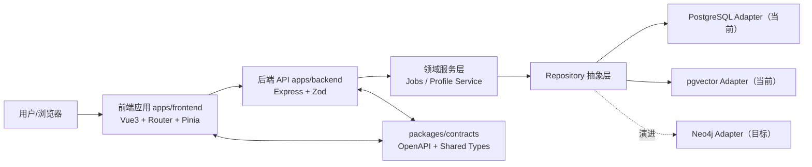
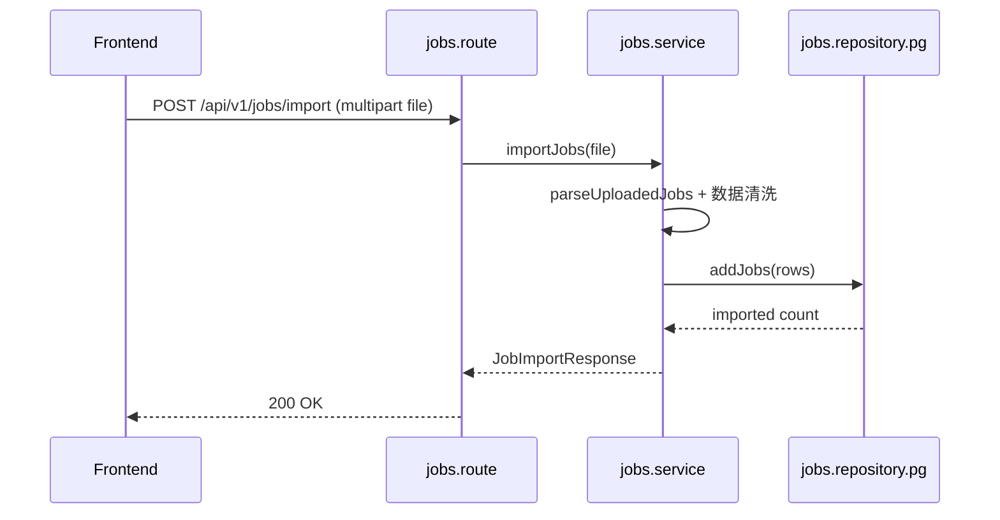
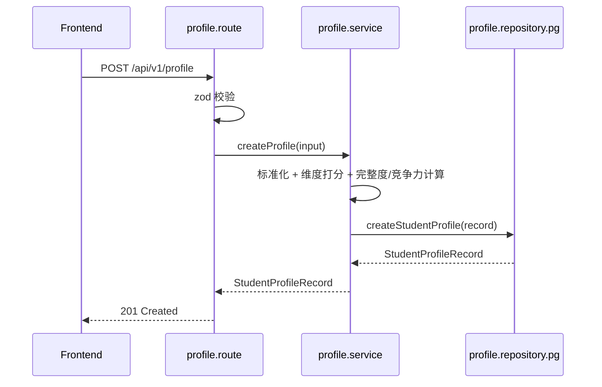

# 项目技术架构（Career Agent）

更新时间：2026-04-02  
适用仓库：`/Users/peach/develop/career-agent`

## 1. 文档目标

本文件用于统一说明 Career Agent 项目的技术架构基线，覆盖：

- Monorepo 工程组织方式。
- 前后端分层与模块边界。
- 契约优先（OpenAPI + 共享类型）协作机制。
- 当前可运行架构与目标演进架构。

## 2. 架构设计原则

1. 契约优先：接口字段变更先改 `packages/contracts`，再改实现。
2. 分层解耦：前端 `app/features/shared`，后端 `route -> service -> repository -> adapter`。
3. 模块内聚：业务能力按 domain 组织，避免横向散落。
4. 可替换存储：结构化数据统一落 PostgreSQL，向量检索走 pgvector，图谱关系预留 Neo4j。
5. 单仓协同：前后端与 contracts 统一在一个仓库中进行版本演进。
6. 单一模型主链路：当前只允许 `Pi Coding Agent` 作为业务运行时模型入口，禁止并行维护独立 `Chat Completions` 业务链路。

## 3. 技术栈总览

| 层次           | 技术选型                                       | 说明                                  |
| -------------- | ---------------------------------------------- | ------------------------------------- |
| 前端           | Vue 3 + TypeScript + Vite + Pinia + Vue Router | 页面展示、交互、状态与路由管理        |
| 后端           | Node.js + Express + TypeScript + Zod + Multer  | REST API、参数校验、文件上传          |
| 契约层         | OpenAPI 3.0 + Shared TypeScript Types          | 前后端共享接口规范与数据类型          |
| 数据层（当前） | PostgreSQL + pgvector                          | 结构化数据与知识检索统一落库          |
| 数据层（目标） | PostgreSQL + pgvector + Neo4j                  | 在现有结构化/向量层基础上补齐图谱能力 |
| 基础设施       | Docker Compose                                 | 本地拉起数据库与图数据库              |

## 4. Monorepo 工程架构

```text
career-agent/
├─ apps/
│  ├─ frontend/                  # Vue 前端（app / features / shared）
│  └─ backend/                   # Express 后端（modules/<domain> / shared）
├─ packages/
│  └─ contracts/
│     ├─ openapi/               # OpenAPI 契约
│     └─ types/                 # 共享 TypeScript 类型
├─ infra/                        # 基础设施编排（docker-compose）
├─ data/                         # 原始数据样本
├─ docs/                         # 项目文档与规范
├─ scripts/                      # 开发脚本
└─ services/                     # 集成服务（当前占位）
```

## 5. 总体分层架构



## 6. 前端架构（apps/frontend）

### 6.1 分层职责

- `src/app`：应用装配层（入口、全局挂载、路由装配）。
- `src/features/<feature>`：业务功能层（页面、feature 路由）。
- `src/shared`：跨 feature 共享能力（API 请求、工具函数、通用 UI）。

### 6.2 当前页面与路由

- `"/"`：`dashboard` 功能首页（`features/dashboard/pages/DashboardPage.vue`）。
- `"/profile"`：`profile` 功能页（`features/profile/pages/ProfilePage.vue`）。

### 6.3 前端与后端通信

- API 基地址由 `VITE_API_BASE_URL` 配置，默认 `http://127.0.0.1:8000`。
- `src/shared/api/jobs.ts` 对接岗位查询。
- `src/shared/api/profile.ts` 对接学生画像列表与创建。
- 请求/响应类型来自 `@career/contracts/types`，避免重复定义。

## 7. 后端架构（apps/backend）

### 7.1 分层职责

- `route`：协议层，处理 HTTP 路由、状态码、请求/响应转换。
- `schemas`：参数校验（Zod）。
- `service`：业务逻辑编排（规则计算、流程控制）。
- `repository`：存储抽象接口。
- `repository.<adapter>`：具体数据源实现（当前为 PostgreSQL/pgvector）。

### 7.2 已实现领域模块

1. `jobs` 域（`src/modules/jobs`）

- `POST /api/v1/jobs/import`：导入岗位数据（csv/tsv/json/xls/xlsx）。
- `GET /api/v1/jobs`：分页/关键词/行业查询岗位。

2. `profile` 域（`src/modules/profile`）

- `GET /api/v1/profile`：查询学生画像列表。
- `POST /api/v1/profile`：创建学生画像并计算完整度、竞争力与维度得分。

### 7.3 应用入口与中间件

- `src/index.ts`：启动服务，监听 `PORT`。
- `src/app.ts`：组装 CORS、JSON body parser、`/healthz`、模块路由与全局错误处理。
- `src/shared/config/env.ts`：统一环境变量读取与校验（Zod）。

### 7.4 Agent 与模型边界

- 唯一业务模型入口：`/api/v2/ai/*` -> `Pi Coding Agent`。
- 兼容策略：旧 `/api/v1/agent/*` 暂时保留为兼容层，内部继续映射到同一套任务型 Agent 执行链路。
- 报告生成策略：职业报告当前固定使用模板生成器，保证输出稳定、可复现、可编辑。
- 明确禁止：不得在 `shared/llm`、独立 smoke 脚本或 report 模块中重新引入 `OpenAI Chat Completions` 直连运行链路，避免仓库再次出现“双主链路”。

## 8. 契约层架构（packages/contracts）

### 8.1 目录与职责

- `openapi/career-agent.openapi.yaml`：API 协议定义。
- `types/index.ts`：前后端共享实体与请求/响应类型。

### 8.2 契约优先流程

1. 修改接口字段时先更新 OpenAPI 与共享类型。
2. 后端按新契约调整 schema/service/repository。
3. 前端按新契约更新 API 调用与页面渲染。
4. 统一执行 `npm run type-check` 确认一致性。

## 9. 数据架构

### 9.1 当前存储方案

- PostgreSQL：岗位、岗位画像、学生画像、匹配结果、报告、导出记录、Agent 任务快照。
- pgvector：知识库 chunk 向量、语义检索与召回评测。
- 特点：支持并发访问、事务、查询过滤与审计留痕，已满足当前联调与演示主链路。

### 9.2 目标扩展方案

- Neo4j：岗位晋升路径、换岗路径、技能迁移关系图。
- 演进策略：保持 service 层稳定，在 repository adapter 边界继续扩展图谱能力。

## 10. 关键运行链路

### 10.1 岗位导入链路



### 10.2 学生画像创建链路



## 11. 环境与部署架构

### 11.1 本地开发

- 根目录 `npm run dev` 并行启动前后端。
- 前端默认：`http://127.0.0.1:5173`。
- 后端默认：`http://127.0.0.1:8000`。
- `infra/docker-compose.yml` 可拉起：
  - `postgres`（pgvector 镜像）
  - `neo4j`

### 11.2 环境变量

- 后端：`APP_ENV`、`PORT`、`PGHOST`、`PGPORT`、`PGDATABASE`、`PGUSER`、`PGPASSWORD`。
- 前端：`VITE_API_BASE_URL`。
- 约束：示例配置必须维护在 `apps/backend/.env.example` 与 `apps/frontend/.env.example`。

## 12. 质量门槛与工程治理

- 最低门槛：`npm run type-check` 必须通过。
- 建议门槛：`npm run format:check`、单元测试、接口测试、CI 集成。
- 结构治理：严格遵循 `docs/工程结构与协作规范.md`。
- 问题沉淀：每次修复后追加 `docs/问题记录库.jsonl`。

## 13. 演进路线（建议）

1. 数据层演进：在现有 `*.repository.pg.ts` 基础上继续补齐 `*.repository.neo4j.ts` 图谱能力。
2. 能力层演进：引入 RAG 检索与模型编排能力，沉淀在独立模块。
3. 质量层演进：补齐前后端测试与 CI，增加 API 兼容性检查。
4. 观测层演进：新增结构化日志、请求链路追踪与核心指标监控。
