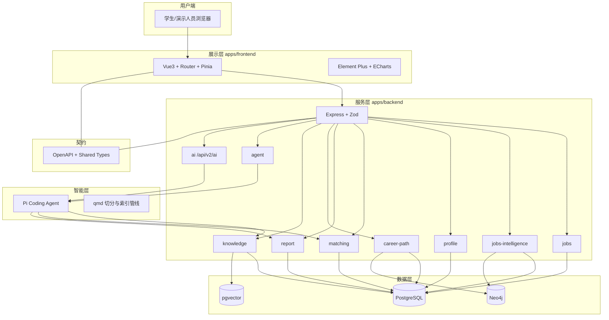
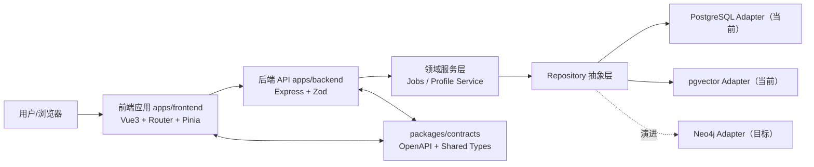
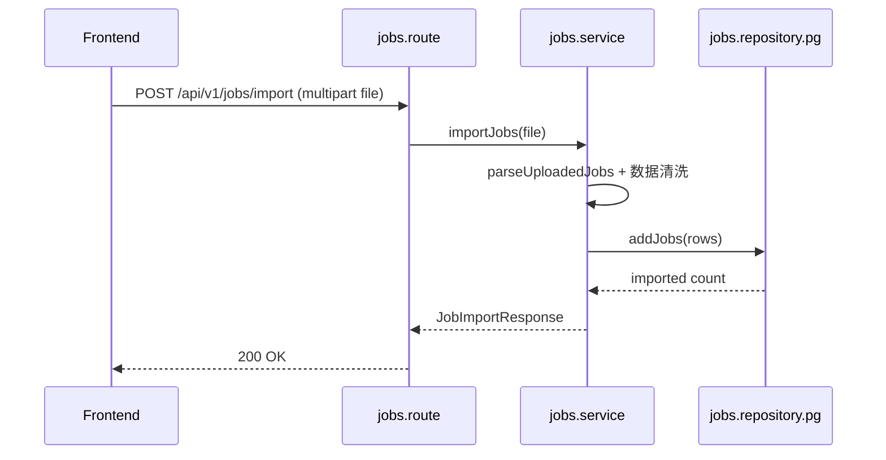
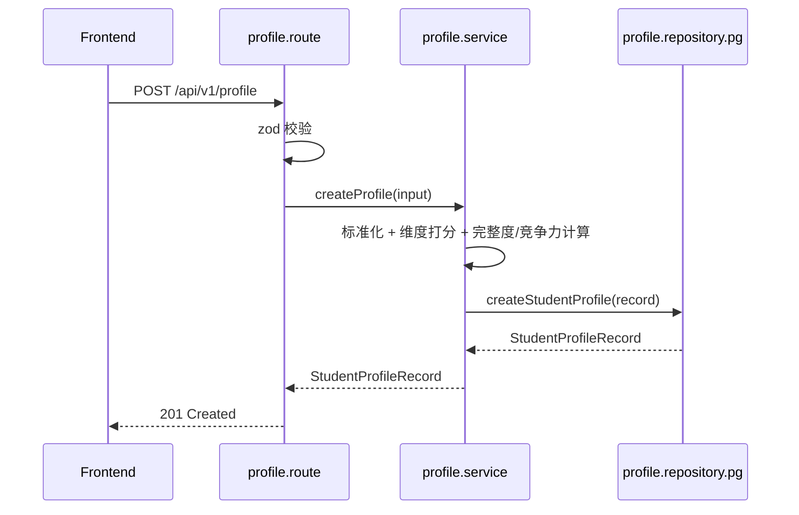

# 项目详细方案

> **文档用途**：第十七届中国大学生服务外包创新创业大赛 **A 类企业命题 A13《基于 AI 的大学生职业规划智能体》** 之「项目详细方案」。本文档面向评委与工程验收，覆盖需求追溯、总体架构、数据与知识库、核心功能、大模型与智能体、前端交互、接口与安全、部署运维、测试评测及风险与交付清单。  
> **自包含说明**：《项目概要介绍》等独立文档已并入 **作品概要**、**第二篇 §2.6**、**第五篇 §5.6**、**第七篇 §7.6～§7.7**、**第八篇 §8.7**、**第四篇 §4.10～§4.11**、**第九篇 §9.3～§9.7**、**第十篇 §10.6～§10.8**；契约真源仍以 OpenAPI 为准。  
> **契约真源**：`packages/contracts/openapi/career-agent.openapi.yaml`。

---

## 目录

0. [作品概要（项目概要介绍）](#作品概要项目概要介绍)
1. [第一篇：背景与需求](#第一篇背景与需求)
2. [第二篇：总体设计](#第二篇总体设计)
3. [第三篇：数据与岗位知识库](#第三篇数据与岗位知识库)
4. [第四篇：核心功能设计](#第四篇核心功能设计)
5. [第五篇：大模型与智能体](#第五篇大模型与智能体)
6. [第六篇：前端与交互设计](#第六篇前端与交互设计)
7. [第七篇：接口规范与安全合规](#第七篇接口规范与安全合规)
8. [第八篇：部署与运维](#第八篇部署与运维)
9. [第九篇：测试、评测与达标论证](#第九篇测试评测与达标论证)
10. [第十篇：风险、里程碑与提交清单](#第十篇风险里程碑与提交清单)

---

## 作品概要（项目概要介绍）

> **文档用途**：大赛提交材料之「项目概要介绍」，供评委快速了解作品定位、核心能力、技术路线与达标情况。**详细设计与验收说明见本文自「第一篇」起各章。**

---

### 一、基本信息

| 项目 | 内容 |
|------|------|
| **命题编号** | A13 |
| **命题方向** | 智能计算 |
| **题目类别** | 应用类 |
| **题目名称** | 基于 AI 的大学生职业规划智能体 |
| **作品名称** | Career Agent（工程仓库名：`career-agent`，工作区目录 `vision-meet`） |
| **命题企业** | 明杉科技 |
| **学校** | 【请填写学校全称】 |
| **团队名称** | 【请填写团队名称】 |
| **指导教师** | 【请填写】 |
| **联系人 / 手机 / 邮箱** | 【请填写】 |

---

### 二、一句话定位

本产品是一套面向高校学生的 **「岗位理解 → 能力画像 → 人岗匹配 → 职业路径 → 生涯报告 → 导出归档」** 全链路 Web 应用：以企业提供的计算机类岗位大数据为基础，结合 **大语言模型与智能体编排（Pi Coding Agent）**、**向量检索（PostgreSQL + pgvector）** 与 **岗位路径图谱（Neo4j）**，帮助学生把碎片化自我认知与岗位要求对齐，输出 **可解释、可编辑、可导出** 的职业生涯发展材料。

---

### 三、行业背景与痛点（赛题对齐）

在数字经济与产业升级背景下，就业市场呈现「新兴领域缺人」与「部分专业就业难」并存的结构性矛盾。大学生职业规划困难，往往源于：

1. **自我认知模糊**：兴趣、能力、性格与岗位匹配关系不清，易跟风考研、考公或「进大厂」，规划缺少个性化与可行性。  
2. **职业信息不对称**：行业与岗位信息来源碎片化，对 AI、新能源等新兴岗位的真实技能与风险认知不足。  
3. **外部支持薄弱**：高校生涯课偏理论与技巧，一线产业洞察不足；家庭引导两极化。  
4. **规划难落地**：缺少实习与项目验证，面对行业快速变化缺少动态调整方法与评估指标。

**本产品价值**：在同一平台内完成 **岗位要求结构化拆解**、**个人能力结构化画像**、**多维度量化匹配与差距解释**、**结合图谱的发展路径展示** 以及 **分阶段行动计划与报告导出**，降低「从信息到行动」的摩擦成本。

---

### 四、用户期望与产品回应（赛题 5. 用户期望）

| 赛题用户期望 | 本产品回应（摘要） |
|--------------|-------------------|
| 快速了解就业市场对应届岗位的能力要求，并拆解具体能力要求 | 岗位导入与检索；**规范岗位画像（canonical roles）** 由 `jobs-intelligence` 聚合（`GET /api/v2/job-profiles` 等）；可结合 **数据流水线** 与知识库检索增强理解 |
| 清晰、准确分析学生就业能力与就业意愿 | **表单录入 + 简历上传** 双入口；简历支持 **PDF/Office/纯文本等解析** 与 **图片简历、扫描版 PDF 的 Pi 多模态视觉解析**（文本抽取失败时回退视觉）；输出结构化 **学生就业能力画像**、**完整度** 与 **竞争力** 评分及维度得分 |
| 给出可操作的生涯发展报告（方案 + 行动计划），扬长避短、精准匹配 | **四维人岗匹配**（基础要求、职业技能、职业素养、发展潜力）+ 差距与建议；**七章节职业报告**（含路径与短中期计划）；支持 **结构化编辑**、**报告页 AI 润色** 与 **PDF 一键导出** |

---

### 五、核心能力清单（对照赛题 6. 任务要求）

#### 5.1 就业岗位要求画像

- 构建 **不少于 10 个** 目标岗位的 **结构化画像**（规范角色层可覆盖大量原始导入岗位）。  
- 画像维度覆盖赛题要求方向，包括但不限于：**专业技能**、**证书要求**、**创新能力**、**学习能力**、**抗压能力**、**沟通能力**、**实习/项目能力** 等（以 `GET /api/v2/canonical-roles*`、`GET /api/v2/job-profiles` 等契约为准）。  
- **数据侧**：`POST /api/v1/jobs/import` + 可选 **`POST /api/v2/jobs/pipeline/run`**（归一化、事实抽取与图谱构建）；前端 **「岗位画像」** 页浏览列表。

#### 5.2 岗位关联图谱与路径

- **垂直岗位图谱**：展示岗位描述及 **晋升路径** 关联（`promotion_routes`）。  
- **换岗路径图谱**：相关岗位 **血缘 / 转换** 关系（`transition_routes`）。  
- 赛题量化要求：**至少 5 个岗位** 具备换岗规划，**每个岗位不少于 2 条** 换岗路径（已在工程里程碑中落地，详见本文 **第三篇、第四篇**）。

#### 5.3 学生就业能力画像

- 数据来源：**简历上传** 或 **表单自行录入**。  
- **简历链路**：`profile.resume-parser` 将文件 **规范为纯文本**；**图片扩展名** 或 **PDF 文本抽取失败** 时走 **`profile.resume-vision`**（Pi **多模态** 输出 `plainText` 与可选姓名/目标岗）；`createProfileModule` 注入 **`resumeVisionParser`**；未配置视觉解析时图片简历返回 **`422 RESUME_VISION_UNAVAILABLE`**。  
- 输出：**结构化能力画像**、**完整度评分**、**竞争力评分** 及与赛题方向一致的维度刻画（结构化推断与打分在 **`profile.service`**）。  
- 大模型：**仅**在视觉解析等明确环节介入；**维度评分**仍以规则与统计信号为主（边界见 **第四篇、第五篇**）。

#### 5.4 学生职业生涯发展报告

- **职业探索与岗位匹配**：结合岗位画像与学生画像，输出 **契合度与差距** 的量化与文字解释。  
- **职业目标与路径规划**：报告内 **career_path** 章节与 **Neo4j 图谱 API** 联动，展示晋升与换岗路径。  
- **行动计划**：**短期 / 中期** 计划章节，含学习与实践安排建议；报告结构支持后续扩展「评估周期与指标」字段。  
- **编辑与导出**：支持 **手动编辑** 各章节并保存；**报告页** 已提供 **单章 / 全文 AI 润色**（`POST /api/v2/ai/polish`）；支持 **PDF 导出与下载**。

#### 5.5 技术要求与指标（赛题）

- **大模型应用**：以 **Pi Coding Agent** 为统一编排入口（`/api/v1/agent/*`），并与 **RAG（qmd + pgvector）** 协同；另提供 **`/api/v2/ai/*`**（任务、对话、润色、简历 HTML 等）作为 **AI 中枢 HTTP 面**。岗位画像主数据由 **`jobs-intelligence`** 维护。  
- **可操作性、可解释性**：匹配结果包含 **四维得分、加权总分、差距列表、改进建议与解释字段**；**`/api/v2/matches*`、`/api/v2/reports*`** 提供增强字段（路径建议、证据引用等），与 V1 并存。  
- **准确性**：依据仓库内 **30 条手工抽样** 评测（20 条匹配 + 10 条画像），**人岗匹配关键技能匹配准确率 80%**、**画像关键信息准确率 92%**，综合判定 **达到赛题阈值**（≥80% / >90%）。数据来源：`data/evaluation/match.manual-samples.jsonl`、`data/evaluation/profile.manual-samples.jsonl`，复算命令见本文 **第九篇**；归一化/图谱可结合 `data/evaluation/` 下基线与 E2E 产物。  
- **实用性**：Vue 3 前端（**`AppLayout` 统一导航**、首页、数据流水线、岗位画像、学生画像、匹配、报告、职业路径等）与 API 联调；**独立 Agent 页已移除**，智能体通过 **报告润色、AI API** 与业务页演示。

---

### 六、技术架构亮点（摘要）

- **单仓 Monorepo**：`apps/frontend`（Vue 3 + TypeScript + Vite + Pinia + Vue Router）、`apps/backend`（Node.js + Express + TypeScript + Zod）、`packages/contracts`（OpenAPI + 共享类型），**契约优先** 协作。  
- **数据层**：**PostgreSQL** 承载岗位、规范岗位事实、学生、匹配、报告等；**pgvector** 承载知识库向量与混合检索；**Neo4j** 承载职业路径图谱（含 V2 自动构建链路）。  
- **业务域**：**`jobs-intelligence`**（`/api/v2` 流水线、规范角色、岗位事实、V2 路径）；**`ai`**（`/api/v2/ai`）；**`profile`**（表单 + 简历 **文本/多模态** 解析，`jobsRepository` 可选注入）。  
- **智能层**：**Pi Coding Agent** 统一编排；**qmd** + `knowledge:index:*`、`knowledge:baseline` 等脚本支撑本地知识库建设（对应大赛「本地知识库资料」）。  
- **工程质量**：统一 **Node 22.20+**；`npm run type-check` 作为合入基线；**`/api/v1` 与 `/api/v2` 并存**。

---

### 七、创新点（评委视角）

1. **可解释的人岗匹配**：严格按赛题四维框架打分，并输出 **可追踪的说明与改进建议**，而非单一「匹配度百分比」。  
2. **路径图谱与报告联动**：图谱查询接口与报告 **career_path** 章节同一数据源逻辑，避免「报告与图谱各说各话」。  
3. **结构化报告 + 版本化**：同一匹配结果可生成多版报告，便于迭代对比与答辩展示。  
4. **可演进架构**：Repository 适配器模式，关系库 / 向量 / 图谱分层清晰；**岗位智能（`jobs-intelligence`）** 与 **AI 中枢（`/api/v2/ai`）** 分域演进，便于院校私有化部署。

---

### 八、当前能力边界与后续规划（诚实声明）

下列能力与赛题表述完全对齐仍存在差距或处于增强阶段，答辩与材料中建议主动说明「当前 / 规划」，避免评委预期落差：

| 能力 | 当前状态 | 说明 |
|------|-----------|------|
| 报告 **智能润色** | **已前后端贯通** | 报告页调用 `POST /api/v2/ai/polish`（单章/全文）；保存仍用 `PATCH`；可选再做「修订 diff 确认」增强 |
| 报告 **一键完整性检查**（自动校验缺项） | 规划中 | 可对七章节做 schema 级规则校验 + 提示 |
| **Word（Docx）导出** | 未作为 MVP | 当前以 **PDF 导出** 为主 |
| 报告正文 **完全由 LLM 端到端生成** | 非默认路径 | MVP 侧重 **模板化 + 结构化数据注入** 以保证稳定性与可编辑性；LLM 增强可按章节逐步放开 |

以上边界与本文 **第七篇 §7.6** 末尾「当前范围说明」一致，并将在演进迭代中逐步缩小。

---

### 九、本文档内章节索引（原独立 `docs/` 文档已并入篇内）

| 原文件名 / 材料 | 并入位置 |
|------------------|-----------|
| 项目详细方案（主干） | 第一篇～第六篇、第八篇及篇内各小节 |
| 项目技术架构 | **第二篇 §2.6** |
| RAG 优化方案 | **第五篇 §5.6** |
| 接口文档 | **第七篇 §7.6** |
| API 端点速查（原附录 A） | **第七篇 §7.7** |
| 环境变量摘要（原附录 B） | **第八篇 §8.7** |
| 数据实体 / 四维评分细则（原附录 C、D） | **第四篇 §4.10～§4.11** |
| 手工抽样评测报告 | **第九篇 §9.3** |
| 图谱/归一化评测摘要（`评测结果-图谱端到端质量.md` 等） | **第九篇 §9.2** 辅助说明；`data/evaluation/` |
| Pi AI 中枢实施清单（`Pi作为系统AI中枢实施清单.md`） | 与 **第五篇**、**第四篇 §4.9** 对照阅读 |
| 评测规范（原附录 E） | **第九篇 §9.7** |
| 项目实现跟踪 | **第十篇 §10.6** |
| 试点模板 / 评分要点（原附录 F、G） | **第十篇 §10.7～§10.8** |
| `packages/contracts/openapi/career-agent.openapi.yaml` | 机器可读契约真源（仓库内路径） |

---

### 十、提交材料对应关系（提示）

| 大赛要求 | 本仓库对应 |
|----------|------------|
| （1）项目概要介绍 | 本文 **作品概要** 章（可单独节选提交） |
| （3）项目详细方案 | 本文档全文（`docs/项目详细方案.md`） |
| （5）① 本地知识库资料 | 知识库初始化与索引脚本、向量表数据、可选打包说明（见本文 **第三篇**） |

---

*文档版本：与仓库实现状态对齐（**`main` 最近一次合并**，含 **简历多模态解析、报告页 AI 润色、AppLayout 与各业务页迭代** 等）；后续迭代请同步更新本文档（含作品概要章）及独立 `docs/` 下若仍维护的摘要文件。*


---

## 第一篇：背景与需求

### 1.1 宏观背景

我国正处于产业升级与数字经济深入发展的阶段，劳动力市场对 **高素质、复合型、具备持续学习能力** 的人才需求上升，同时部分传统专业供给与新兴岗位需求之间存在错配。大学生在职业规划上面临「信息过载但有效结构化信息不足」「自我认知与外部标准难以对齐」「规划停留在纸面难以迭代」等系统性困难。教育部与产业界持续推进就业指导数字化、精准化，企业命题方 **明杉科技** 在教育数智化领域积累了教务、学工、数据中台、一网通办与 **精准就业** 等产品经验，本题要求参赛队伍在 **智能计算** 方向交付可运行的 **AI 职业规划智能体**，具有明确的教学价值与产业落地想象空间。

### 1.2 问题陈述（与赛题一致）

赛题将学生侧痛点归纳为四类，本产品以软件功能 **逐条消解**：

1. **自我认知模糊、定位偏差**：通过 **结构化学生画像**、**完整度与竞争力评分**、**与目标岗位四维对比**，帮助学生把「自我感觉」转化为可对照、可改进的条目。  
2. **职业信息不对称**：通过 **岗位大数据导入**、**岗位画像**、**职业路径图谱** 与可选 **知识库检索**，把岗位要求与发展路径从「帖子与传说」还原为 **可查询、可解释** 的信息。  
3. **外部支持薄弱**：本产品定位为 **7×24 可复用的自助式智能体**，在师资不足场景下仍可完成基础诊断与行动清单；输出报告可交由导师二次批注。  
4. **规划落地性差**：报告内 **短期 / 中期计划** 章节与 **差距—行动** 映射，强调实习、项目与技能补齐路径；后续可扩展「评估周期与 KPI」字段以支持动态复盘。

### 1.3 建设目标

在赛事周期内交付 **可演示、可评测、可解释** 的端到端系统：

- **业务闭环**：岗位数据进入系统 →（可选）**归一化流水线** → **规范岗位画像** → 学生画像（表单/简历，含 **多模态简历解析**）→ 人岗匹配 → 职业报告（多版本）→ 编辑 → **报告页 AI 润色** → PDF 导出 → 职业路径可视化。  
- **技术闭环**：Monorepo 工程 + 契约优先 + PostgreSQL/pgvector/Neo4j + **`jobs-intelligence`（V2）** + **`ai`（/api/v2/ai）** + Pi Coding Agent 编排 + RAG 管线持续演进。  
- **质量闭环**：手工抽样评测集 + 可复算脚本 + Markdown 报告，对标赛题 **80% / 90%** 准确率门槛。

### 1.4 需求追溯矩阵（赛题条目 → 实现映射）

下列矩阵用于评委「逐条勾选」验收；模块名为后端 `apps/backend/src/modules/<domain>` 习惯称谓，具体以 OpenAPI 路径为准。

**（1）就业岗位要求画像**

- **赛题 a**：不少于 10 个岗位画像；维度含专业技能、证书、创新能力、学习能力、抗压能力、沟通能力、实习能力等。  
- **实现**：`jobs` 模块负责 **`POST /api/v1/jobs/import`**、**`GET /api/v1/jobs`**；**`jobs-intelligence`** 负责规范角色与画像聚合（**`GET /api/v2/job-profiles`** 兼容旧列表形态、**`GET /api/v2/canonical-roles*`**、**`POST /api/v2/jobs/pipeline/run`** 等）；字段以 OpenAPI 为准。  
- **验收**：导入 ≥10 条岗位记录后，经流水线或种子数据可在「岗位画像」页展示 ≥10 个可解释画像条目；抽检与职位描述/规范角色一致性。  
- **状态**：已落地（规范角色 + 流水线 + 兼容桥接，见第四篇 §4.1～§4.2）。

**（2）岗位关联图谱**

- **赛题 b-1 垂直图谱**：岗位描述 + 晋升路径关联。  
- **实现**：`career-path`（或等价路由模块）；Neo4j 存储；`GET /api/v1/career-paths/jobs/{job_id}` 返回 `promotion_routes`、`nodes`、`edges`。  
- **验收**：前端 `/career-paths` 可展示晋升链。  
- **状态**：已落地（首轮闭环；实施进度见 **第十篇 §10.6**）。

- **赛题 b-2 换岗图谱**：血缘关系；至少 5 个岗位，每岗 ≥2 条换岗路径。  
- **实现**：**`GET /api/v1/career-paths/jobs/{job_id}`**（种子图谱）与 **`GET /api/v2/career-paths/jobs/{job_id}`**（`jobs-intelligence` 自动图谱）均可返回 `transition_routes`；种子由 `npm run career-path:sync` 同步；V2 依赖流水线写入 Neo4j。  
- **验收**：枚举 5 个规范岗位，逐岗核对 ≥2 条 `transition_routes`（V1 或 V2 数据源其一即可演示）。  
- **状态**：已落地。

**（3）学生就业能力画像**

- **赛题 a**：简历上传或自行录入；大模型拆解画像；完整度、竞争力评分。  
- **赛题 b**：维度与岗位侧同向（专业技能、证书、创新、学习、抗压、沟通、实习等）。  
- **实现**：`profile` 模块；`POST /api/v1/profile`、`POST /api/v1/profile/resume`（**文本解析 + 多模态视觉回退**）；`profile.service` 返回 `completeness_score`、`competitiveness_score`、`dimension_scores` 等；可选注入 **`jobsRepository`** 与岗位库联动。  
- **验收**：同一学生 **表单** 与 **简历（文本 PDF / 图片任选其一）** 各跑一次；无视觉能力时勿用纯图片简历验收。  
- **状态**：已落地。

**（4）职业生涯发展报告**

- **赛题 a 职业探索与匹配**：人岗匹配度、契合与差距量化。  
- **实现**：`matching` + `report`；`POST /api/v1/matches`；报告章节 `match_analysis` 等。  
- **状态**：已落地。

- **赛题 b 目标与路径**：行业趋势 + 岗位数据关联性 + 个人擅长 + 发展路径示例。  
- **实现**：报告 `career_path` + 图谱 API；概述类内容可由模板与数据拼接，Agent 增强见第五篇。  
- **状态**：MVP 已落地。

- **赛题 c 行动计划**：短期、中期；学习与实践；评估周期与指标。  
- **实现**：`short_term_plan`、`mid_term_plan` 章节；评估指标可在正文中结构化描述，独立字段可后续扩展。  
- **状态**：MVP 已落地。

- **赛题 d 编辑优化与导出**：智能润色、完整性检查、手动编辑、一键导出。  
- **实现**：`PATCH /api/v1/reports/{report_id}` 手动编辑；**报告页 AI 润色** → `POST /api/v2/ai/polish`；`POST/GET .../exports` + `GET .../download` PDF。  
- **规划**：**一键完整性检查**（自动校验缺项）仍可增强；Docx 导出非 MVP。  
- **状态**：编辑 + **润色（前后端已通）** + PDF 已落地；完整性检查 / Docx 未作为默认交付。

**（5）技术要求与指标**

- **大模型**：Pi Coding Agent + **`/api/v2/ai/*` AI 中枢** + 业务工具 + RAG 管线；禁止并行维护与上述无关的独立 Chat Completions 业务主链路（工程约束）。  
- **可解释匹配**：四维打分 + 权重 + 说明。  
- **准确率**：见第九篇。  
- **实用性**：前端多页面联调完成。

---

## 第二篇：总体设计

### 2.1 设计原则

1. **契约优先**：接口与共享类型以 `packages/contracts` 为单一真源，变更顺序 OpenAPI → 后端 schema/service → 前端调用。  
2. **分层解耦**：前端 `app / features / shared`；后端 `route → service → repository → adapter`。  
3. **可替换存储**：业务代码依赖 repository 抽象，PostgreSQL 为当前主存储；向量与图数据库在适配器边界扩展。  
4. **稳定演示与可演进平衡**：报告生成采用 **模板 + 结构化数据** 保证答辩稳定；LLM 与 Agent 在编排与检索侧逐步加深。

### 2.2 逻辑架构



### 2.3 模块边界说明

- **jobs**：岗位数据文件 **导入**、分页 **列表查询**（原始岗位浏览）。  
- **jobs-intelligence（V2）**：岗位 **归一化流水线**、**规范角色（canonical roles）**、**岗位事实**、**V2 职业路径图**、兼容 **`/api/v2/job-profiles`** 列表协议。  
- **profile**：学生画像创建（表单/简历）；**简历** 经 `resume-parser` / `resume-vision` 归一化为文本后再走 `profile.service`；支持注入 **`jobsRepository`**。  
- **matching**：创建匹配、列表、详情、指纹缓存（内部可解析 V2 路径摘要）。  
- **report**：报告版本生成、查询、章节 PATCH、PDF 导出与下载。  
- **career-path**：按 `job_id` 查询 **首轮种子** 图谱（晋升/换岗）；与 **V2 自动图谱** 并存。  
- **knowledge**：知识库索引、混合检索、评测相关 API（见 OpenAPI）。  
- **agent**：`/api/v1/agent/*` 任务创建、查询、对话别名等，对接 Pi SDK。  
- **ai**：`/api/v2/ai/*` 统一 AI 任务、润色、简历 HTML、对话等 HTTP 面，运行时与 Pi 对齐。

### 2.4 关键业务时序（摘要）

**岗位导入**：前端 multipart → `jobs.route` → `jobs.service` 解析清洗 → `repository.pg` 持久化 → 返回导入条数。可选：根目录 **`npm run data:pipeline:prepare`** 产出归一化 CSV → **`npm run data:pipeline:import`** 或 **`POST /api/v2/jobs/pipeline/run`** 触发后端流水线 → `jobs-intelligence` 写事实表与图。

**学生画像**：JSON 或简历文件 → 校验 → 维度与完整度/竞争力计算 → 持久化 → 返回 `StudentProfileRecord`。

**匹配与报告**：选定 `student_profile_id` 与 `job_id` → 确保岗位画像版本 → 四维评分与解释 → 可选缓存 → 基于 `match_id` 生成报告新版本 → 用户 PATCH 编辑 → 触发 PDF 导出任务 → 下载。

### 2.5 Monorepo 目录（与仓库一致）

```text
vision-meet/
├── apps/
│   ├── frontend/          # Vue3 前端
│   └── backend/           # Express 后端
├── packages/
│   └── contracts/         # OpenAPI + types
├── infra/                 # docker-compose 等
├── data/                  # 原始数据、评测样本等
├── docs/                  # 文档
└── scripts/               # 根级脚本（如有）
```


### 2.6 项目技术架构（工程文档全文）

更新时间：2026-04-08  
适用仓库：本 Monorepo 根目录（`vision-meet` / `career-agent`）

##### 1. 文档目标

本文件用于统一说明 Career Agent 项目的技术架构基线，覆盖：

- Monorepo 工程组织方式。
- 前后端分层与模块边界。
- 契约优先（OpenAPI + 共享类型）协作机制。
- 当前可运行架构与目标演进架构。

##### 2. 架构设计原则

1. 契约优先：接口字段变更先改 `packages/contracts`，再改实现。
2. 分层解耦：前端 `app/features/shared`，后端 `route -> service -> repository -> adapter`。
3. 模块内聚：业务能力按 domain 组织，避免横向散落。
4. 可替换存储：结构化数据统一落 PostgreSQL，向量检索走 pgvector，图谱关系落 **Neo4j**（已联调）。
5. 单仓协同：前后端与 contracts 统一在一个仓库中进行版本演进。
6. 单一模型主链路：当前只允许 `Pi Coding Agent` 作为业务运行时模型入口，禁止并行维护独立 `Chat Completions` 业务链路。

##### 3. 技术栈总览

| 层次 | 技术选型 | 说明 |
| --- | --- | --- |
| 前端 | Vue 3 + TypeScript + Vite + Pinia + Vue Router | 页面展示、交互、状态与路由管理 |
| 后端 | Node.js + Express + TypeScript + Zod + Multer | REST API、参数校验、文件上传 |
| 契约层 | OpenAPI 3.0 + Shared TypeScript Types | 前后端共享接口规范与数据类型 |
| 数据层（当前） | PostgreSQL + pgvector + Neo4j | 结构化数据、向量检索与职业路径图谱 |
| 基础设施 | Docker Compose | 本地拉起数据库与图数据库 |

##### 4. Monorepo 工程架构

```text
career-agent/
├─ apps/
│  ├─ frontend/                  # Vue 前端（app / features / shared）
│  └─ backend/                   # Express 后端（modules/<domain> / shared）
├─ packages/
│  └─ contracts/
│     ├─ openapi/               # OpenAPI 契约
│     └─ types/                 # 共享 TypeScript 类型
├─ infra/                        # 基础设施编排（docker-compose）
├─ data/                         # 原始数据样本
├─ docs/                         # 项目文档与规范
├─ scripts/                      # 开发脚本
└─ services/                     # 集成服务（当前占位）
```

##### 5. 总体分层架构



##### 6. 前端架构（apps/frontend）

###### 6.1 分层职责

- `src/app`：应用装配层（入口、全局挂载、路由装配）。
- `src/features/<feature>`：业务功能层（页面、feature 路由）。
- `src/shared`：跨 feature 共享能力（API 请求、工具函数、通用 UI）。

###### 6.2 当前页面与路由

- `"/"`：`dashboard` 功能首页（`features/dashboard/pages/DashboardPage.vue`）。
- `"/profile"`：`profile` 功能页（`features/profile/pages/ProfilePage.vue`）。

###### 6.3 前端与后端通信

- API 基地址由 `VITE_API_BASE_URL` 配置，默认 `http://127.0.0.1:8000`。
- `src/shared/api/jobs.ts` 对接岗位查询。
- `src/shared/api/profile.ts` 对接学生画像列表与创建。
- 请求/响应类型来自 `@career/contracts/types`，避免重复定义。

##### 7. 后端架构（apps/backend）

###### 7.1 分层职责

- `route`：协议层，处理 HTTP 路由、状态码、请求/响应转换。
- `schemas`：参数校验（Zod）。
- `service`：业务逻辑编排（规则计算、流程控制）。
- `repository`：存储抽象接口。
- `repository.<adapter>`：具体数据源实现（当前为 PostgreSQL/pgvector）。

###### 7.2 已实现领域模块

1. `jobs` 域（`src/modules/jobs`）
- `POST /api/v1/jobs/import`：导入岗位数据（csv/tsv/json/xls/xlsx）。
- `GET /api/v1/jobs`：分页/关键词/行业查询岗位。

2. `jobs-intelligence` 域（`src/modules/jobs-intelligence`，挂载 `/api/v2`）
- 岗位流水线、规范角色、岗位事实、V2 职业路径、兼容 `GET /api/v2/job-profiles` 等。

3. `ai` 域（`src/modules/ai`，挂载 `/api/v2/ai`）
- AI 任务、润色、简历 HTML、对话；运行时与 Pi 对齐。

4. `profile` 域（`src/modules/profile`）
- `GET /api/v1/profile`：查询学生画像列表。
- `POST /api/v1/profile`：创建学生画像并计算完整度、竞争力与维度得分。
- `POST /api/v1/profile/resume`：简历上传；依赖 **`profile.resume-parser`**、可选 **`profile.resume-vision`**（`createResumeVisionParser` 注入路由）。
- 单测：`apps/backend/src/modules/profile/__tests__/profile.service.test.ts`。

###### 7.3 应用入口与中间件

- `src/index.ts`：启动服务，监听 `PORT`。
- `src/app.ts`：组装 CORS、JSON body parser、`/healthz`、模块路由与全局错误处理。
- `src/shared/config/env.ts`：统一环境变量读取与校验（Zod）。

###### 7.4 Agent / AI 与模型边界

- **统一编排内核**：`Pi Coding Agent`；对外 HTTP 包括 **`/api/v1/agent/*`** 与 **`/api/v2/ai/*`**（后者为 AI 中枢专用路由）。
- 兼容策略：旧 `/api/v1/agent/chat` 仅作为协议别名，内部直接映射到当前任务型 Agent。
- 报告生成策略：职业报告 **默认** 仍以模板生成器为主；**报告页润色** 与独立调用均走 **`/api/v2/ai/polish`**。
- 明确禁止：不得在业务代码中并行维护与 Pi 无关的独立 **`Chat Completions` 主链路**，避免「双主链路」回归。

##### 8. 契约层架构（packages/contracts）

###### 8.1 目录与职责

- `openapi/career-agent.openapi.yaml`：API 协议定义。
- `types/index.ts`：前后端共享实体与请求/响应类型。

###### 8.2 契约优先流程

1. 修改接口字段时先更新 OpenAPI 与共享类型。
2. 后端按新契约调整 schema/service/repository。
3. 前端按新契约更新 API 调用与页面渲染。
4. 统一执行 `npm run type-check` 确认一致性。

##### 9. 数据架构

###### 9.1 当前存储方案

- PostgreSQL：原始岗位、**规范岗位事实与流水线任务表**、学生画像、匹配结果、报告、导出记录、Agent/AI 任务快照等。
- pgvector：知识库 chunk 向量、语义检索与召回评测。
- 特点：支持并发访问、事务、查询过滤与审计留痕，已满足当前联调与演示主链路。

###### 9.2 图谱层（Neo4j）

- **已接入**：首轮种子图谱（`career-path:sync`）与 **V2 自动构建**（`jobs-intelligence` 写入/查询）并存。
- 演进策略：保持 service 层稳定，在 repository adapter 边界继续扩展图谱规则与评测。

##### 10. 关键运行链路

###### 10.1 岗位导入链路



###### 10.2 学生画像创建链路



##### 11. 环境与部署架构

###### 11.1 本地开发

- 根目录 `npm run dev` 并行启动前后端。
- 前端默认：`http://127.0.0.1:5173`。
- 后端默认：`http://127.0.0.1:8000`。
- `infra/docker-compose.yml` 可拉起：
  - `postgres`（pgvector 镜像）
  - `neo4j`

###### 11.2 环境变量

- 后端：`APP_ENV`、`PORT`、`PGHOST`、`PGPORT`、`PGDATABASE`、`PGUSER`、`PGPASSWORD`。
- 前端：`VITE_API_BASE_URL`。
- 约束：示例配置必须维护在 `apps/backend/.env.example` 与 `apps/frontend/.env.example`。

##### 12. 质量门槛与工程治理

- 最低门槛：`npm run type-check` 必须通过。
- 建议门槛：`npm run format:check`、单元测试、接口测试、CI 集成。
- 结构治理：严格遵循 `docs/工程结构与协作规范.md`。
- 问题沉淀：每次修复后追加 `docs/问题记录库.jsonl`。

##### 13. 演进路线（建议）

1. 数据层演进：在现有 `*.repository.pg.ts` 基础上继续补齐 `*.repository.neo4j.ts` 图谱能力。
2. 能力层演进：引入 RAG 检索与模型编排能力，沉淀在独立模块。
3. 质量层演进：补齐前后端测试与 CI，增加 API 兼容性检查。
4. 观测层演进：新增结构化日志、请求链路追踪与核心指标监控。


---

## 第三篇：数据与岗位知识库

### 3.1 企业岗位数据集（赛题说明）

赛题说明企业提供约 **10000 条**、约 **100 个岗位类别** 的计算机类信息化相关行业数据，字段包括：**职位名称、工作地址、薪资范围、公司全称、所属行业、人员规模、企业性质、职位编码、职位描述、公司简介** 等。  
本系统通过 **`POST /api/v1/jobs/import`** 支持 **CSV / TSV / TXT / JSON / XLS / XLSX** 等常见格式，便于对接企业网盘下发文件。

### 3.2 数据清洗策略

- **字段别名映射**：不同表头（如「岗位名称」「职位名称」）归一到内部 schema。  
- **编码与去噪**：统一 UTF-8；去除非法控制字符；薪资、地址等可保留原文或结构化扩展字段（按实现版本）。  
- **原始保留**：在可行情况下保留原始 payload 或摘要，便于审计与后续 LLM 再分析。  
- **万级岗位资产化（工程化）**：根目录 Python 脚本 `scripts/job_data_asset_pipeline.py`（经 `npm run data:pipeline:prepare` 调用）可从 `data/岗位数据.xls` 等源生成 `data/processed/jobs_cleaned.csv` 等产物，供 **`job-normalized:import`** 与 **V2 流水线** 消费（详见 `docs/todoList-*` 系列说明）。

### 3.3 本地知识库资料（大赛提交 5①）

**建设目的**：支撑「岗位以外的」行业政策、培养方案、技能学习路径、项目文档等 **RAG 证据**，使 Agent 或未来问答具备 **可引用片段**，提升可解释性与专业性。

**工程能力**（根目录脚本，工作区指向 `career-backend`）：

- `npm run knowledge:init`：初始化知识库相关库表/扩展（与 `knowledge-init` 脚本一致）。  
- `npm run knowledge:index:jobs`：将岗位相关文本切块并向量化入库。  
- `npm run knowledge:index:project-docs`：索引仓库内项目文档等。  
- `npm run knowledge:eval`：检索质量基线评测。  
- `npm run knowledge:baseline`：写入/对比 `data/evaluation/knowledge/` 下基线 JSON（辅助回归）。

**技术要点**（与 **第五篇 §5.6** 第四节「qmd 优化策略」一致，此处照录）：

- **分块策略**：优先按标题层级切分，再按 token 上限二次切分。  
- **元数据策略**：记录来源文件、章节路径、岗位标签、时间戳。  
- **召回策略**：同问题并发多路检索（岗位库、行业库、案例库）；关键词 + 向量混合，可选重排序。  
- **去重策略**：相似 chunk 合并，避免上下文重复占用。  
- **更新策略**：增量更新索引，避免全量重建。  
- **存储**：`pgvector` 与 PostgreSQL 同行部署，降低运维复杂度。

**提交建议**：除代码外，可打包「索引所用的原始文档目录清单 + 索引说明 README + 可选预构建向量 dump（若体积允许）」；答辩现场以 **可复现脚本** 为主更稳妥。

### 3.4 规范岗位与 Neo4j 图谱数据

岗位原始数据条目标题多样，需映射到 **规范角色（canonical role）** 以构建可读的晋升 / 换岗网络。

- **归一化**：`canonical_role_key` / `canonical_role_title` 与 `job_id` 的映射由 **`jobs-intelligence` 仓库层** 维护；流水线任务将事实与图同步至 Neo4j。  
- **同步脚本**：`npm run career-path:sync` 将 **首轮** 路径种子写入 Neo4j（与 `career-path` 模块配合）。  
- **运行时**：**`GET /api/v1/career-paths/jobs/{job_id}`**（种子/兼容层）；**`GET /api/v2/career-paths/jobs/{job_id}`**（V2 自动图谱，由 `jobs-intelligence` 聚合）；均可选 `student_profile_id` 为路径附加 **技能缺口** 提示。

---

## 第四篇：核心功能设计

### 4.1 岗位查询与画像生成

- **原始岗位查询**：`GET /api/v1/jobs`，支持 `keyword`、`industry`、`offset`、`limit`，用于浏览导入后的职位列表。  
- **规范岗位画像（当前主路径）**：由 **`jobs-intelligence`** 提供，例如：  
  - **`GET /api/v2/job-profiles`**：兼容历史前端的列表形态（响应内 `items` 由规范角色 **桥接** 为类 `JobProfile` 结构）。  
  - **`GET /api/v2/canonical-roles`**、**`GET /api/v2/canonical-roles/{role_key}`**：标准角色详情（技能簇、工具、软技能、职责摘要、置信度等）。  
  - **`GET /api/v2/job-facts`**、**`GET /api/v2/job-facts/{job_id}`**：单条导入岗位的归一化事实与证据字段。  
- **流水线**：**`POST /api/v2/jobs/pipeline/run`** 触发异步归一化/建图；**`GET /api/v2/jobs/pipeline/tasks/{task_id}`** 查询进度；失败与重试见 **`.../failures`**、**`.../retry-queue`** 等端点（以 OpenAPI 为准）。  
- **说明**：历史 **`POST /api/v1/jobs/profile/generate`（单岗即时生成）已移除**，避免与规范角色主线重复；答辩与验收以 **V2 列表 + canonical 详情** 为准。

### 4.2 岗位画像与赛题「不少于 10 个」

工程上 **规范角色与事实表可覆盖大量导入岗位**。赛题「不少于 10 个」为最低要求；验收时任选 **10 个规范画像条目**（或 10 条可映射到规范角色的原始岗）展示即可。

### 4.3 职业路径图谱 API

**V1（种子/兼容）**：`GET /api/v1/career-paths/jobs/{job_id}`  

**V2（岗位智能/自动图谱）**：`GET /api/v2/career-paths/jobs/{job_id}`  

**查询参数**（两组接口均支持，具体以契约为准）：

- `student_profile_id`（可选）：用于个性化缺口技能摘要。  
- `depth`（可选，1–3）：子图深度，默认 2。

**响应核心**：

- `nodes` / `edges`：供前端 **ECharts** 力导向或关系图渲染。  
- `promotion_routes`：**垂直晋升** 序列。  
- `transition_routes`：**换岗路径**，每岗多条。  
- 错误码示例：`JOB_NOT_FOUND`、`CAREER_PATH_ROLE_NOT_MAPPED`、`CAREER_PATH_GRAPH_UNAVAILABLE`，便于演示时排查配置。

### 4.4 学生画像：表单录入

**路径**：`POST /api/v1/profile`

**典型字段**：姓名、`target_role`、技能列表、`personal_summary` 等（以 OpenAPI 为准）。

**输出**：`dimension_scores`、`completeness_score`、`competitiveness_score`、`summary`、`source_type` 等。

**设计意图**：快速人工录入适合 **课堂无简历文件** 的演示；字段与后续匹配维度对齐。

### 4.5 学生画像：简历上传

**路径**：`POST /api/v1/profile/resume`（`multipart/form-data`）

**字段**：`file` 必填；`target_role` 必填（可与「待定岗位」等占位配合 **视觉推断**）；`name` 可选；`parse_mode`：`strict | tolerant`。

**解析策略（实现要点）**：

1. **文本优先**：`profile.resume-parser` 按扩展名选择 **纯文本 / `pdftotext` / `textutil`（Office）** 等，得到 `plainText`。  
2. **图片简历**：`.png`/`.jpg`/`.webp`/`.bmp` 等 **直接走** `profile.resume-vision`（Pi 多模态），产出 `plainText` 与可选 **姓名、目标岗位**（若表单未填且模型返回）。  
3. **PDF 回退**：当文本抽取失败且已配置 `resumeVisionParser` 时，**同一 PDF 可走视觉链路** 得到正文。  
4. **不可用**：未注入视觉解析器时上传图片 → **`RESUME_VISION_UNAVAILABLE`（422）**；全文仍为空 → **`RESUME_TEXT_EMPTY`（422）**。  

**业务层**：`profile.service` 在归一化文本上做结构化字段推断与 **完整度/竞争力** 等规则评分；与 **匹配四维打分** 的边界见 §4.6。

### 4.6 人岗匹配：四维框架（赛题硬性要求）

**路径**：`POST /api/v1/matches`

**维度**（与赛题一致）：

1. **基础要求**：学历、专业背景、基础门槛类匹配。  
2. **职业技能**：硬技能与岗位技能权重对比。  
3. **职业素养**：沟通、协作、责任与稳定性等。  
4. **发展潜力**：学习成长性、可迁移技能、上限空间等。

**输出**：

- `dimension_scores`：各维得分。  
- `total_score`：按 **可配置权重** 加权后的综合分。  
- `gaps`：缺口列表。  
- `suggestions`：可执行建议。  
- `explanations`：文字解释，服务「可解释性」评分点。  
- `from_cache` / `input_fingerprint`：同一输入复现，便于评测与答辩。

**列表与详情**：`GET /api/v1/matches`、`GET /api/v1/matches/{match_id}`。

### 4.7 职业生涯发展报告

**生成**：`POST /api/v1/reports`，请求体 `{ "match_id": <id> }`，每次生成 **新版本**（`version` 递增）。

**固定七章**（`sections`，`key` 唯一）：

1. `overview`：总览。  
2. `match_analysis`：匹配分析。  
3. `strengths`：优势。  
4. `gaps_and_actions`：差距与行动。  
5. `career_path`：路径（与图谱叙事一致）。  
6. `short_term_plan`：短期计划。  
7. `mid_term_plan`：中期计划。

**编辑**：`PATCH /api/v1/reports/{report_id}` 必须提交 **完整 7 章** 结构，避免部分更新导致状态不一致。

**导出 PDF**：`POST /api/v1/reports/{report_id}/exports`，`format: pdf`；列表 `GET .../exports`；下载 `GET /api/v1/report-exports/{export_id}/download`。

### 4.8 编辑优化、润色与完整性（赛题 d 对照）

| 子需求 | 实现状态 | 说明 |
|--------|-----------|------|
| 手动编辑 | 已支持 | PATCH 保存结构化章节 |
| 一键导出 | 已支持（PDF） | Docx 为后续增强 |
| 智能润色 | **已前后端支持** | 报告页「AI 润色」→ `POST /api/v2/ai/polish`；单章与全文顺序润色；持久化仍 `PATCH` |
| 完整性检查 | 规划中 | 建议：Zod/OpenAPI 级章节非空校验、关键字段检查表、可读性提示 |

### 4.9 与 Agent / AI 模块的协同边界

**`/api/v1/agent/*`** 与 **`/api/v2/ai/*`** 均走 **Pi 编排**，工具层覆盖 **拉取任务上下文、知识检索、创建匹配、创建报告** 等（见 `apps/backend/src/modules/ai/tools`）。**默认报告生成**仍以模板为主保证稳定性；润色、简历 HTML 等走 **AI 专用路由**。演进路线是 **按章节逐步 LLM 化**，每次变更配套评测回归。

### 4.10 核心数据实体说明（概念模型，原附录 C）

下列为 **逻辑实体**，物理表名以实现为准，用于详细设计评审与答辩问答。

**Job（岗位原始记录）**

- 对应导入行：标题、描述、行业、薪资、公司信息等。  
- 与 `job_id` 主键关联画像、匹配、图谱映射。

**JobProfile（岗位画像快照）**

- 结构化技能、证书、软素质、权重、摘要、置信度、`profile_version`。  
- 匹配时记录 `job_profile_version` 以便复现「当时依据的岗位要求版本」。

**StudentProfile（学生画像）**

- `source_type` 区分表单 / 简历；`source_digest` 等用于去重或溯源（若启用）。  
- `dimension_scores` 与 `completeness_score`、`competitiveness_score` 服务赛题「完整度、竞争力」。

**MatchResult（匹配结果）**

- 四维分数、加权总分、`gaps`、`suggestions`、`explanations`。  
- `scoring_version`：评分规则版本化，支撑评测与回归。  
- `input_fingerprint`：输入指纹，用于缓存与科学对比实验。

**CareerReport（职业报告）**

- 与 `match_id` 绑定；`version` 递增；`sections` 为七章数组元素，每元素含 `key`、`title`、`content`（或等价结构）。

**ReportExport（导出记录）**

- `format`（如 `pdf`）、`file_name`、`file_size_bytes`、`download_path` 或等价下载标识。

**KnowledgeChunk（知识块）**

- `chunk_text`、`embedding`、`metadata`（来源、章节、标签）。  
- 服务 RAG 证据链。

**AgentTask（智能体任务快照）**

- 计划步骤、工具调用轨迹、警告信息、与业务结果引用；用于审计与答辩演示「智能体如何工作」。

---

### 4.11 人岗匹配四维评分细则（答辩解释稿，原附录 D）

本小节供评委追问「分数怎么来的」时使用，具体权重以系统配置与代码为准。

**1. 基础要求**

- 关注点：学历层次、专业对口度、硬性门槛（如证书、年限）是否在简历/表单中有对应证据。  
- 常见失分原因：目标岗位为后端开发但简历无语言与框架证据；学历字段缺失导致保守打分。

**2. 职业技能**

- 关注点：岗位画像中的硬技能与学生技能列表、项目经历的交集与深度。  
- 可解释输出：「岗位强调分布式与 K8s，学生仅有单机部署经验」→ 明确进入 `gaps` 与 `suggestions`。

**3. 职业素养**

- 关注点：沟通协作、文档习惯、责任心、抗压（可从项目描述、角色、社团经历推断；证据不足时降置信度）。  
- 赛题对齐：避免纯关键词匹配，结合 **解释字段** 说明推断依据。

**4. 发展潜力**

- 关注点：学习能力信号（自学课程、竞赛、开源）、可迁移技能、成长轨迹。  
- 用途：区分「当下完全匹配」与「短期可培养」候选人，符合企业校招真实决策。

**综合分**

- 对各维得分按 **岗位可配置权重** 加权求和，权重可随岗位类别调整（如研发岗抬高职业技能权重）。  
- 输出中同时保留 **维度分** 与 **总分**，满足「可解释性」评分点。

---

## 第五篇：大模型与智能体

### 5.1 选型与角色分工

- **Pi Coding Agent**：业务运行时 **统一模型编排内核**；对外暴露 **`/api/v1/agent/*`（兼容入口）** 与 **`/api/v2/ai/*`（AI 中枢 HTTP）** 等，负责任务拆解、工具调用与结果汇总。  
- **qmd + pgvector**：文档切分、向量索引与混合检索，为 Agent / AI 任务提供 **证据片段**。  
- **岗位画像 / 报告默认链路**：规范角色与模板为主；LLM 用于 **简历解析、润色、Agent 总结** 等 **明确边界** 的能力，避免「全文黑盒生成」导致答辩不可控。

### 5.2 禁止双主链路的工程原因

若同时存在 **直连 Chat Completions** 与 **Pi 编排** 两套互不相干的业务入口，会导致：提示词分叉、结果不可比、密钥与审计分散、类型契约难以统一。本仓库明确 **模型能力统一经 Pi 编排落地**（含 **`/api/v1/agent/*`** 与 **`/api/v2/ai/*`**）；历史别名 `/api/v1/agent/chat` 映射到当前任务型 Agent，而非并行体系。

### 5.3 Agent 任务与工具（概念）

结合实现代码与 OpenAPI，Pi 侧工具包括但不限于：**`load_task_context`**、**`search_knowledge`**、**`create_match`**、**`create_report`**（见 `apps/backend/src/modules/ai/tools`）。HTTP 层 **`POST /api/v2/ai/tasks`** 创建通用 AI 任务；**`POST /api/v2/ai/polish`** 文本润色；**`POST /api/v2/ai/resume-html`** 生成简历 HTML；**`POST /api/v2/ai/chat`** 对话入口。任务步骤轨迹落库供审计与失败重试。

### 5.4 失败降级与可观测性

- **检索为空**：降级为规则摘要或提示用户补充关键词。  
- **模型不可用**：报告仍可通过模板生成；Agent 接口返回明确错误码。  
- **自检**：`npm run agent:smoke`（在 `career-backend`）用于环境连通性最小验证。

### 5.5 RAG 质量目标

检索与回答质量的量化指标见 **第五篇 §5.6** 第六节：**Recall@K、MRR**、**事实一致性、证据覆盖率、可解释性评分**，以及业务指标 **关键技能匹配准确率 ≥80%、画像关键信息准确率 >90%**、任务成功率与重试成功率等，并与迭代联动。


### 5.6 RAG 优化方案（Pi + qmd，全文）

创建日期：2026-04-01

##### 1. 目标

1. 提升岗位知识与职业规划知识的检索召回质量。
2. 让大模型回答具备证据引用与可解释性。
3. 通过 `Pi Coding Agent` 管理多阶段任务，降低链路不稳定性。

##### 2. 技术选型

1. 智能体编排：`Pi Coding Agent`。
2. 文档处理：`qmd`（主），`Marker/PyMuPDF`（补充解析）。
3. 向量检索：`PostgreSQL + pgvector`。
4. 结构化存储：`PostgreSQL`。

##### 3. 端到端链路

1. 数据输入：岗位数据、行业资料、政策资料、课程资料、简历文本。
2. 文档预处理：去噪、规范编码、章节识别、表格文本化。
3. `qmd` 结构化切分：按语义段落和标题层级生成 chunk。
4. 向量化入库：保存 `chunk_text + metadata + embedding`。
5. 检索阶段：关键词召回 + 向量召回 + 重排序。
6. Agent 编排：`Pi Coding Agent` 串联检索、分析、报告生成。
7. 输出阶段：回答内容 + 证据片段 + 置信度。

##### 4. qmd 优化策略

1. 分块策略：优先按标题层级切分，再按 token 上限二次切分。
2. 元数据策略：记录来源文件、章节路径、岗位标签、时间戳。
3. 召回策略：同问题并发多路检索（岗位库、行业库、案例库）。
4. 去重策略：相似 chunk 合并，避免上下文重复占用。
5. 更新策略：增量更新索引，避免全量重建。

##### 5. Pi Coding Agent 编排职责

1. 查询意图识别：区分岗位问答、能力诊断、路径规划、报告生成。
2. 工具编排：触发检索、评分、报告模板、导出等工具。
3. 证据约束：回答必须绑定检索证据片段。
4. 失败重试：检索为空或证据不足时自动降级与重试。
5. 审计日志：记录每次工具调用、耗时、失败原因。

##### 6. 评测指标

1. 检索召回：Recall@K、MRR。
2. 回答质量：事实一致性、证据覆盖率、可解释性评分。
3. 业务指标：关键技能匹配准确率 >= 80%，画像关键信息准确率 > 90%。
4. 稳定性：任务成功率、平均响应时长、重试成功率。

##### 7. 实施顺序

1. 完成 qmd 文档切分和入库脚本。
2. 接入 pgvector 检索和评测脚本。
3. 接入 Pi Coding Agent 编排层。
4. 打通“检索 -> 匹配 -> 报告”全链路。
5. 完成 A/B 评测并固化最优参数。


---

## 第六篇：前端与交互设计

### 6.1 技术栈

- **框架**：Vue 3 + TypeScript + Vite。  
- **状态与路由**：Pinia、Vue Router。  
- **UI**：Element Plus。  
- **图形**：ECharts（职业路径可视化）；架构目标中曾含 G6，以实际依赖为准。

### 6.2 工程分层

- `src/app`：入口、全局样式、路由装配。  
- `src/features/<feature>`：业务内聚页面与 feature 级路由。  
- `src/shared`：`api`、工具、通用组件。

### 6.3 页面与路由（当前）

| 路径 | 功能模块 | 用户任务 |
|------|-----------|-----------|
| `/` | dashboard | 总览、入口导航、各功能入口 |
| `/pipeline` | data-pipeline | 查看/触发岗位 **数据流水线** 与任务进度（对接 `/api/v2/jobs/pipeline/*`） |
| `/job-profiles` | job-profiles | 浏览 **规范岗位画像** 列表与详情（对接 `/api/v2/job-profiles`、`canonical-roles` 等） |
| `/profile` | profile | 表单 / 简历创建学生画像 |
| `/matching` | matching | 选择画像与岗位，发起匹配，跳转报告或路径 |
| `/report` | report | 查看 / 编辑报告版本，**单章/全文 AI 润色**（`/api/v2/ai/polish`），导出 PDF |
| `/career-paths` | career-path | 查看岗位图谱与晋升、换岗路径 |

**说明**：原 **`/agent` 独立演示页已删除**；智能体能力通过 **后端 Agent/AI API**、报告页与脚本 `npm run agent:smoke` 等验证。

### 6.4 推荐演示脚本（答辩友好）

1. 导入岗位文件（`/api/v1/jobs/import`）→ 列表检索目标行业岗位。  
2. （可选）**数据流水线**：`/pipeline` 或 `npm run jobs:pipeline:run` → 等待任务完成 → 打开 **`/job-profiles`** 展示规范画像与技能簇。  
3. 录入学生信息或上传简历（**文本 PDF 与图片简历各演示一种**）→ 展示完整度与竞争力。  
4. 创建匹配 → 展开四维得分与差距建议（可对比 V1/V2 匹配接口字段）。  
5. 生成报告 → 浏览七章 → 现场编辑保存 → 使用 **报告页「AI 润色」**（单章或全文）→ 导出 PDF。  
6. 打开职业路径页 → 展示晋升与换岗路径（**V1 或 V2 API**）；若传 `student_profile_id` 展示缺口提示。

### 6.5 可用性与无障碍（简述）

- 表单校验错误与 API `VALIDATION_ERROR` 映射为用户可读中文。  
- 关键操作（匹配、导出）提供加载态与失败重试入口。  
- 色弱对比度遵循 Element Plus 默认主题；若校赛有要求可再加强。

---

## 第七篇：接口规范与安全合规

### 7.1 REST 约定

- **Base**：默认 `http://127.0.0.1:8000`（本地）。  
- **版本前缀**：**`/api/v1`**（主业务闭环）与 **`/api/v2`**（岗位智能、增强匹配/报告、AI 中枢）并存；路径以 **`packages/contracts/openapi/career-agent.openapi.yaml`** 为准。  
- **Content-Type**：JSON；上传接口使用 `multipart/form-data`。

### 7.2 统一错误结构

```json
{
  "code": "VALIDATION_ERROR",
  "message": "请求参数不合法",
  "detail": {},
  "trace_id": "可选UUID"
}
```

### 7.3 与赛题强相关的端点索引

- 原始岗位：`/api/v1/jobs/import`、`/api/v1/jobs`  
- 规范画像与流水线：`/api/v2/jobs/pipeline/*`、`/api/v2/job-profiles`、`/api/v2/canonical-roles*`、`/api/v2/job-facts*`  
- 学生画像：`/api/v1/profile`、`/api/v1/profile/resume`  
- 匹配：`/api/v1/matches*`；增强 **`/api/v2/matches*`**  
- 报告：`/api/v1/reports*`、`/api/v1/report-exports/*`；增强 **`/api/v2/reports*`、`/api/v2/report-exports/*`**  
- 路径：**`/api/v1/career-paths/jobs/{job_id}`**、**`/api/v2/career-paths/jobs/{job_id}`**  
- 知识库：`/api/v1/knowledge/*`（索引、检索、评测）  
- Agent：`/api/v1/agent/*`  
- AI 中枢：**`/api/v2/ai/*`**（`tasks`、`polish`、`resume-html`、`chat` 等）  
- 健康检查：`GET /healthz`

完整字段级说明见 **第七篇 §7.6** 与 OpenAPI 契约。

### 7.4 配置与密钥

- 后端环境变量集中校验（`apps/backend` 内 `shared/config/env.ts` 等）。  
- **必须** 维护 `apps/backend/.env.example`、`apps/frontend/.env.example`，**禁止** 将真实密钥提交仓库。  
- 数据库、Neo4j、模型服务密钥仅通过环境变量注入。

### 7.5 隐私与合规

- 简历与画像属 **个人敏感信息**，演示数据集应 **脱敏**（虚构姓名、电话、邮箱）。  
- 生产/试点部署建议：访问控制、审计日志、数据留存策略与学校信息化规范对齐。  
- 本方案默认 **院校本地化部署** 友好，不上传学生数据至不可信第三方（取决于实际 `.env` 配置，需在部署文档中声明）。


### 7.6 Career Agent 接口文档（全文）

更新时间：2026-04-08  
适用仓库：本 Monorepo 根目录（`vision-meet` / `career-agent`）

##### 1. 文档说明

本文件用于提供 Career Agent 当前后端 REST API 的人读版说明，便于前后端联调、接口验收和演示准备。

契约源码以以下文件为准：

1. OpenAPI：`packages/contracts/openapi/career-agent.openapi.yaml`
2. 共享类型：`packages/contracts/types/index.ts`

接口字段变更时，必须先更新 contracts，再同步本文件。

##### 2. 基本信息

- Base URL：`http://127.0.0.1:8000`
- 接口风格：`/api/v1` 与 `/api/v2` 版本化 REST API（字段以 OpenAPI 为准）
- 返回格式：`application/json`

##### 3. 通用错误响应

除上传文件的 multipart 请求外，所有接口均返回统一 JSON 错误结构：

```json
{
  "code": "VALIDATION_ERROR",
  "message": "请求参数不合法",
  "detail": {},
  "trace_id": "2b54cf0c-xxxx-xxxx-xxxx-xxxxxxxxxxxx"
}
```

字段说明：

1. `code`：错误码，供前端稳定判断错误语义。
2. `message`：面向用户或调用方的错误说明。
3. `detail`：可选，通常用于字段级校验错误。
4. `trace_id`：可选，请求追踪标识，便于排障。

##### 4. 接口总览

| 模块 | 方法 | 路径 | 说明 |
| --- | --- | --- | --- |
| Health | `GET` | `/healthz` | 服务健康检查 |
| Jobs | `POST` | `/api/v1/jobs/import` | 导入岗位数据文件 |
| Jobs | `GET` | `/api/v1/jobs` | 查询岗位列表 |
| Jobs Intel | `GET` | `/api/v2/job-profiles` | 规范岗位画像列表（兼容旧 `JobProfile` 形态） |
| Jobs Intel | `GET` | `/api/v2/canonical-roles` | 标准岗位角色列表 |
| Jobs Intel | `POST` | `/api/v2/jobs/pipeline/run` | 触发岗位智能流水线 |
| AI | `POST` | `/api/v2/ai/polish` | 文本润色（Pi 编排） |
| AI | `POST` | `/api/v2/ai/tasks` | 创建 AI 任务 |
| Profile | `GET` | `/api/v1/profile` | 查询学生画像列表 |
| Profile | `POST` | `/api/v1/profile` | 手动创建学生画像 |
| Profile | `POST` | `/api/v1/profile/resume` | 通过简历上传创建学生画像 |
| Matching | `POST` | `/api/v1/matches` | 创建人岗匹配结果 |
| Matching | `GET` | `/api/v1/matches` | 查询匹配结果列表 |
| Matching | `GET` | `/api/v1/matches/{match_id}` | 查询匹配结果详情 |
| Career Path | `GET` | `/api/v1/career-paths/jobs/{job_id}` | 查询岗位图谱与路径规划（种子/兼容） |
| Career Path | `GET` | `/api/v2/career-paths/jobs/{job_id}` | V2 自动图谱（jobs-intelligence） |
| Report | `POST` | `/api/v1/reports` | 基于匹配结果生成职业报告版本 |
| Report | `GET` | `/api/v1/reports?match_id=` | 查询某个匹配结果下的报告版本列表 |
| Report | `GET` | `/api/v1/reports/{report_id}` | 查询职业报告详情 |
| Report | `PATCH` | `/api/v1/reports/{report_id}` | 保存职业报告结构化章节编辑结果 |
| Report | `POST` | `/api/v1/reports/{report_id}/exports` | 生成并登记 PDF 导出产物 |
| Report | `GET` | `/api/v1/reports/{report_id}/exports` | 查询当前报告版本的导出记录 |
| Report Export | `GET` | `/api/v1/report-exports/{export_id}/download` | 下载已生成的 PDF 文件 |

##### 5. Health

###### `GET /healthz`

说明：返回服务状态与当前数据存储路径。

成功响应示例：

```json
{
  "status": "ok",
  "env": "dev",
  "store": "/path/to/data.json"
}
```

##### 6. Jobs

###### `POST /api/v1/jobs/import`

说明：上传 CSV / TSV / TXT / JSON / XLS / XLSX 岗位文件并导入。

请求类型：`multipart/form-data`

请求字段：

1. `file`：必填，岗位数据文件。

成功响应示例：

```json
{
  "imported": 10,
  "skipped": 0,
  "message": "导入完成"
}
```

###### `GET /api/v1/jobs`

说明：按关键字、行业和分页条件查询岗位列表。

Query 参数：

1. `keyword`：可选，岗位关键字。
2. `industry`：可选，行业筛选。
3. `offset`：可选，默认 `0`。
4. `limit`：可选，默认 `20`，最大 `100`。

成功响应字段：

1. `total`：总记录数。
2. `items`：岗位数组，元素类型为 `JobRecord`。

###### 岗位画像（V2，替代已移除的 `POST /api/v1/jobs/profile/generate`）

说明：**`POST /api/v1/jobs/profile/generate` 已从实现与 OpenAPI 中删除。** 岗位画像改由 **`jobs-intelligence`** 从规范角色与岗位事实聚合；列表接口兼容旧前端字段形态。

推荐端点：

1. **`GET /api/v2/job-profiles`**：分页列表，`items` 内为桥接后的类 `JobProfile` 结构。  
2. **`GET /api/v2/canonical-roles/{role_key}`**：标准角色详情（技能簇、工具、软技能、职责摘要、置信度等）。  
3. **`POST /api/v2/jobs/pipeline/run`**：需要刷新归一化结果或重建图时触发流水线。

##### 7. Profile

###### `GET /api/v1/profile`

说明：查询学生画像列表。

成功响应字段：

1. `total`
2. `items`：学生画像数组，元素类型为 `StudentProfileRecord`。

###### `POST /api/v1/profile`

说明：通过手动录入创建学生画像。

请求体核心字段：

```json
{
  "name": "张三",
  "target_role": "前端开发工程师",
  "skills": ["TypeScript", "Vue"],
  "personal_summary": "具备组件化开发经验"
}
```

成功响应核心字段：

1. `id`
2. `source_type`
3. `source_digest`
4. `dimension_scores`
5. `completeness_score`
6. `competitiveness_score`
7. `summary`

###### `POST /api/v1/profile/resume`

说明：通过简历文件上传创建学生画像；服务端先将文件 **归一化为纯文本**（含 **图片简历的 Pi 多模态解析**、**PDF 文本失败时的视觉回退**），再进入 `profile.service` 结构化抽取与评分。

请求类型：`multipart/form-data`

请求字段：

1. `file`：必填，简历文件（支持常见文本、PDF、Office、**图片**等，具体以前端提示与运行时依赖为准）。
2. `target_role`：必填，目标岗位（可与「待定岗位」等占位配合视觉推断）。
3. `name`：可选，学生姓名。
4. `parse_mode`：可选，`strict | tolerant`，默认 `tolerant`。

常见错误码：`RESUME_VISION_UNAVAILABLE`（未启用图片解析）、`RESUME_TEXT_EMPTY`（无法得到正文）。

成功响应结构与手动创建画像一致。

##### 8. Matching

###### `POST /api/v1/matches`

说明：基于学生画像和岗位生成一条人岗匹配结果。

请求体：

```json
{
  "student_profile_id": 1,
  "job_id": 1001,
  "force_recalculate": false
}
```

成功响应核心字段：

1. `id`
2. `student_profile_id`
3. `job_id`
4. `job_profile_version`
5. `scoring_version`
6. `input_fingerprint`
7. `from_cache`
8. `dimension_scores`
9. `total_score`
10. `gaps`
11. `suggestions`
12. `explanations`

###### `GET /api/v1/matches`

说明：按学生画像、岗位、分页条件查询匹配结果摘要列表。

Query 参数：

1. `student_profile_id`：可选。
2. `job_id`：可选。
3. `offset`：可选，默认 `0`。
4. `limit`：可选，默认 `20`，最大 `100`。

成功响应字段：

1. `total`
2. `items`：匹配结果摘要数组，元素类型为 `MatchResultSummary`。

###### `GET /api/v1/matches/{match_id}`

说明：查询单条匹配结果详情。

Path 参数：

1. `match_id`：必填，匹配结果 ID。

成功响应结构与 `POST /api/v1/matches` 返回结构一致。

常见错误码：

1. `MATCH_NOT_FOUND`
2. `JOB_NOT_FOUND`
3. `STUDENT_PROFILE_NOT_FOUND`

##### 9. Report

###### `POST /api/v1/reports`

说明：基于既有 `match_id` 生成一份新的职业报告版本。

请求体：

```json
{
  "match_id": 1
}
```

成功响应核心字段：

1. `id`
2. `match_id`
3. `version`
4. `student_profile_id`
5. `job_id`
6. `total_score`
7. `sections`
8. `created_at`
9. `updated_at`

章节固定为以下 7 个：

1. `overview`
2. `match_analysis`
3. `strengths`
4. `gaps_and_actions`
5. `career_path`
6. `short_term_plan`
7. `mid_term_plan`

###### `GET /api/v1/reports`

说明：按 `match_id` 查询该匹配结果下的所有报告版本。

Query 参数：

1. `match_id`：必填，匹配结果 ID。

成功响应字段：

1. `total`
2. `items`：报告摘要数组，按 `version desc` 排列。

###### `GET /api/v1/reports/{report_id}`

说明：查询单份职业报告详情。

Path 参数：

1. `report_id`：必填，报告 ID。

成功响应字段：

1. `id`
2. `match_id`
3. `version`
4. `student_profile_id`
5. `job_id`
6. `total_score`
7. `sections`
8. `created_at`
9. `updated_at`

###### `PATCH /api/v1/reports/{report_id}`

说明：保存当前报告版本的结构化章节编辑结果，不创建新版本。

请求体示例：

```json
{
  "sections": [
    {
      "key": "overview",
      "title": "报告摘要",
      "content": "当前整体匹配度较高，建议保持优势并补齐短板。"
    }
  ]
}
```

注意：实际提交时必须传入完整的 7 个章节，且 `key` 必须完整、唯一、合法。

常见错误码：

1. `REPORT_NOT_FOUND`
2. `REPORT_SECTION_INVALID`

###### `POST /api/v1/reports/{report_id}/exports`

说明：为指定报告版本生成一份新的 PDF 导出产物，并立即返回可下载记录。

Path 参数：

1. `report_id`：必填，报告 ID。

请求体：

```json
{
  "format": "pdf"
}
```

成功响应核心字段：

1. `id`
2. `report_id`
3. `format`
4. `file_name`
5. `file_size_bytes`
6. `created_at`
7. `download_path`

常见错误码：

1. `REPORT_NOT_FOUND`
2. `REPORT_EXPORT_GENERATION_FAILED`

###### `GET /api/v1/reports/{report_id}/exports`

说明：查询当前报告版本的历史导出记录列表。

Path 参数：

1. `report_id`：必填，报告 ID。

成功响应字段：

1. `total`
2. `items`：导出记录数组，按导出时间倒序排列。

###### `GET /api/v1/report-exports/{export_id}/download`

说明：下载已生成的 PDF 文件。

Path 参数：

1. `export_id`：必填，导出记录 ID。

成功响应：

1. `Content-Type: application/pdf`
2. `Content-Disposition: attachment`

##### 10. Career Path

###### `GET /api/v1/career-paths/jobs/{job_id}`

说明：基于岗位 ID 返回规范岗位图谱、首批晋升/换岗路径，以及可选的学生个性化技能缺口摘要。

Path 参数：

1. `job_id`：必填，岗位 ID。

Query 参数：

1. `student_profile_id`：可选，学生画像 ID；传入后会对每条路径补充缺口技能。
2. `depth`：可选，图谱深度，范围 `1-3`，默认 `2`。

成功响应核心字段：

1. `job_id`
2. `job_title`
3. `student_profile_id`
4. `canonical_role_key`
5. `canonical_role_title`
6. `target_node_id`
7. `nodes`
8. `edges`
9. `promotion_routes`
10. `transition_routes`

常见错误码：

1. `JOB_NOT_FOUND`
2. `CAREER_PATH_ROLE_NOT_MAPPED`
3. `CAREER_PATH_GRAPH_UNAVAILABLE`

##### 11. 当前范围说明

当前已实现接口能力覆盖：

1. 岗位导入、原始列表查询；**规范岗位画像与流水线（`/api/v2` jobs-intelligence）**。
2. 学生画像创建与查询（**简历文本解析 + 图片/扫描 PDF 多模态解析**，见 `profile.resume-parser` / `profile.resume-vision`）。
3. 人岗匹配创建、列表、详情与复现缓存（**V1/V2 并存**）。
4. 职业报告生成、版本列表、详情、结构化编辑保存与 PDF 导出（**V1/V2 并存**）。
5. 职业路径图谱查询（**V1 种子 + V2 自动图谱**）。
6. **AI 中枢**（`/api/v2/ai/*`）：任务、润色、简历 HTML、对话等。

当前未纳入或仅部分纳入接口范围：

1. DOCX 导出
2. 报告 **一键完整性检查**（自动化 schema 校验提示）
3. 报告正文 **默认** 仍以模板注入为主；全量 LLM 端到端生成非默认路径

### 7.7 与赛题相关的 API 端点索引（评委速查，原附录 A）

下列列表为 **功能向** 摘要，字段级定义以 `career-agent.openapi.yaml` 为准。

**系统与健康**

- `GET /healthz`：服务存活探测；联调与运维巡检入口。

**岗位 jobs（原始）**

- `POST /api/v1/jobs/import`：`multipart` 上传岗位数据文件，返回导入/跳过计数。  
- `GET /api/v1/jobs`：分页与筛选列表，支撑「浏览就业市场岗位」场景。

**岗位智能 jobs-intelligence（V2）**

- `POST /api/v2/jobs/pipeline/run`：触发归一化/建图流水线。  
- `GET /api/v2/jobs/pipeline/tasks/{task_id}` 等：任务进度、失败明细与重试队列。  
- `GET /api/v2/job-profiles`：规范画像列表（兼容旧 `JobProfile` 响应形态）。  
- `GET /api/v2/canonical-roles`、`GET /api/v2/canonical-roles/{role_key}`：标准角色。  
- `GET /api/v2/job-facts`、`GET /api/v2/job-facts/{job_id}`：岗位事实。

**学生画像 profile**

- `GET /api/v1/profile`：画像列表，便于管理多次录入/多角色目标。  
- `POST /api/v1/profile`：结构化表单创建。  
- `POST /api/v1/profile/resume`：简历文件创建。

**人岗匹配 matching**

- `POST /api/v1/matches`：创建一条匹配结果（四维 + 总分 + 差距 + 建议 + 解释）。  
- `GET /api/v1/matches`：条件过滤列表。  
- `GET /api/v1/matches/{match_id}`：详情，用于报告生成前核对。  
- **`POST /api/v2/matches`、`GET /api/v2/matches*`**：增强字段（路径建议、证据引用等，见契约）。

**职业报告 report**

- `POST /api/v1/reports`：按 `match_id` 新建报告版本。  
- `GET /api/v1/reports?match_id=`：同一匹配下多版本列表。  
- `GET /api/v1/reports/{report_id}`：报告详情（七章 `sections`）。  
- `PATCH /api/v1/reports/{report_id}`：整包保存七章编辑结果。  
- `POST /api/v1/reports/{report_id}/exports`：触发 PDF 导出。  
- `GET /api/v1/reports/{report_id}/exports`：导出历史。  
- `GET /api/v1/report-exports/{export_id}/download`：下载 PDF 二进制流。  
- **`/api/v2/reports*`、`/api/v2/report-exports/*`**：增强生成模式与结构化行动计划等（见契约）。

**职业路径 career-path**

- `GET /api/v1/career-paths/jobs/{job_id}`：图谱节点边 + 晋升路径 + 换岗路径；可选学生画像 ID。  
- **`GET /api/v2/career-paths/jobs/{job_id}`**：V2 自动图谱（`jobs-intelligence`）。

**知识库 knowledge**

- `POST /api/v1/knowledge/index`：索引任务提交（具体 body 见契约）。  
- `POST /api/v1/knowledge/search`：混合检索。  
- `POST /api/v1/knowledge/evaluations`：检索评测任务。

**智能体 agent**

- `POST /api/v1/agent/tasks`：创建编排任务。  
- `GET /api/v1/agent/tasks/{task_id}`：任务状态与结果。  
- `POST /api/v1/agent/chat`：兼容别名，内部指向统一任务型 Agent（以实现为准）。

**AI 中枢 ai（V2）**

- `POST /api/v2/ai/tasks`、`GET /api/v2/ai/tasks/{task_id}`：通用 AI 任务。  
- `POST /api/v2/ai/polish`：文本润色。  
- `POST /api/v2/ai/resume-html`、`GET /api/v2/ai/resume-html/{resume_id}`：简历 HTML。  
- `POST /api/v2/ai/chat`：对话入口。

---

---

## 第八篇：部署与运维

### 8.1 运行环境

- **Node.js**：`>=22.20.0 <23`（见根目录 `package.json` engines 与 `.nvmrc` / `.node-version`）。  
- **包管理**：仓库根目录 `npm install`。  
- **可选**：Python 资产化脚本依赖 `uv run`（见 `npm run data:pipeline:prepare`）。

### 8.2 本地开发

```bash
npm run dev
```

并行启动前端（默认 Vite 端口如 5173）与后端（默认 `PORT` 如 8000）。亦可：

```bash
npm run dev:backend
npm run dev:frontend
```

### 8.3 数据库与中间件

- `infra/docker-compose.yml`：拉起 **PostgreSQL（pgvector 镜像）**、**Neo4j** 等（以文件为准）。  
- 后端连接参数：`PGHOST`、`PGPORT`、`PGDATABASE`、`PGUSER`、`PGPASSWORD` 等。

### 8.4 前端 API 基地址

- 环境变量 `VITE_API_BASE_URL`，默认指向 `http://127.0.0.1:8000`。

### 8.5 构建与类型检查

```bash
npm run type-check
npm run build
```

### 8.6 运维演进（建议）

- 结构化日志、请求 ID 贯通、基础指标（QPS、错误率、P95 延迟）。  
- CI 中强制执行 `type-check` 与 `format:check`。  
- 数据库迁移版本化管理（按团队后续选型）。

### 8.7 环境变量与本地配置（原附录 B）

**后端（常见）**

- `APP_ENV`：运行环境标识（如 `dev`）。  
- `PORT`：HTTP 监听端口。  
- `PGHOST` / `PGPORT` / `PGDATABASE` / `PGUSER` / `PGPASSWORD`：PostgreSQL 连接。  
- Neo4j 相关变量（以 `apps/backend/.env.example` 为准）：连接 URI、用户、密码等。  
- Agent / 模型相关：以 Pi Coding Agent 官方配置目录及 `.env.example` 说明为准（含 `AGENT_MODEL` 等自动推断项）。

**前端**

- `VITE_API_BASE_URL`：浏览器侧访问后端的基地址。

**原则**：示例仅进 `.env.example`；真实密钥进本地 `.env` 或密钥管理系统，**绝不**提交至 Git。

---

---

## 第九篇：测试、评测与达标论证

### 9.1 赛题指标复述

- **人岗匹配**：关键技能匹配准确率 **不低于 80%**。  
- **岗位画像与学生画像**：抽样评估关键信息准确率 **超过 90%**。  
- **判断方法**：匹配从 **基础要求、职业技能、职业素养、发展潜力** 四维对比打分，按岗位维度权重综合；每维先分析再汇总。

### 9.2 本项目评测方法

采用 **手工抽样 + JSONL 标注 + 可复算脚本**：

- **匹配样本**：20 条（`data/evaluation/match.manual-samples.jsonl`）。  
- **画像样本**：10 条（`data/evaluation/profile.manual-samples.jsonl`）。  
- **统计**：  
  - `match_accuracy = is_correct=true 数量 / 20`  
  - `profile_accuracy = Σ correct_fields / Σ checked_fields`  
- **阈值**：`match_accuracy >= 0.80` 且 `profile_accuracy > 0.90`。  
- **辅助（工程化）**：归一化质量可运行 **`npm run evaluation:normalized:e2e`**；图谱端到端评测见 `docs/process-图谱层与评测工程化-TDD.md` 与 `apps/backend/src/scripts/evaluation-graph-e2e.ts`（是否封装为 npm script 以 `package.json` 为准），产物可落在 `data/evaluation/`（另见 `评测结果-岗位标准化证据一致性.md`、`评测结果-图谱端到端质量.md`）。**与赛题 80%/90% 手工门槛相互独立**，用于回归与答辩补强。

### 9.3 评测结果（手工抽样评测报告全文）

生成时间：2026-04-02T15:46:23.524Z

#### 1. 样本规模

- 匹配样本：20 条
- 画像样本：10 条
- 总样本：30 条

#### 2. 统计口径

- `match_accuracy = is_correct=true 数量 / match 总样本`
- `profile_accuracy = Σcorrect_fields / Σchecked_fields`
- 阈值：`match_accuracy >= 0.80` 且 `profile_accuracy >= 0.90`。

#### 3. 指标结果

- match_accuracy：0.8（通过）
- profile_accuracy：0.92（通过）
- 综合判定：通过

#### 4. 未通过样本清单

##### 4.1 匹配样本

- M003：is_correct=false，备注：缺少特征工程证据
- M007：is_correct=false，备注：沟通协同证据不足
- M010：is_correct=false，备注：自动化部署覆盖不足
- M017：is_correct=false，备注：业务抽象维度证据不足

##### 4.2 画像样本（correct_fields < checked_fields）

- P002：correct_fields=9 / checked_fields=10（计算 accuracy=0.9，标注 accuracy=0.9）
- P003：correct_fields=9 / checked_fields=10（计算 accuracy=0.9，标注 accuracy=0.9）
- P005：correct_fields=8 / checked_fields=10（计算 accuracy=0.8，标注 accuracy=0.8）
- P007：correct_fields=9 / checked_fields=10（计算 accuracy=0.9，标注 accuracy=0.9）
- P009：correct_fields=9 / checked_fields=10（计算 accuracy=0.9，标注 accuracy=0.9）
- P010：correct_fields=8 / checked_fields=10（计算 accuracy=0.8，标注 accuracy=0.8）

#### 5. 标注一致性检查

- 画像样本中 `accuracy` 与 `correct_fields / checked_fields` 一致。

#### 6. 数据来源

- match 文件：data/evaluation/match.manual-samples.jsonl
- profile 文件：data/evaluation/profile.manual-samples.jsonl

**改进叙事**：未通过匹配样本后续可通过 **丰富简历解析字段、引入项目经历结构化、调整权重与解释模板** 迭代。

### 9.4 复现命令

在仓库根目录执行（调用 workspace `career-backend` 脚本）：

```bash
npm run evaluation:manual
```

实际实现入口：`apps/backend` 内 `tsx src/scripts/evaluation-manual.ts`。

### 9.5 检索基线评测（辅助）

```bash
npm run knowledge:eval
```

用于 RAG 演进，不等同于赛题 80%/90%，但可证明知识库建设 **可度量**。

### 9.6 前测试建议（团队自测清单）

- 导入极小样本（1 条）与极大样本（数千条）性能与超时。  
- 简历多种格式：**纯文本 / PDF / Office**、**图片简历**、**扫描 PDF**（验证文本抽取与 **vision 回退**）；乱码与空文件容错（`RESUME_TEXT_EMPTY` 等）。  
- 后端 **`profile.service`**：仓库内已补充 **`profile.service.test.ts`**（以项目选用的测试运行器执行，可与 `npm run type-check` 一起做合并前自检）。  
- Neo4j 未启动时 career-path 接口错误提示是否友好。  
- PDF 导出并发与磁盘临时文件清理。

### 9.7 手工抽样评测规范（可复现，原附录 E）

**样本设计**

- 匹配 20 条：覆盖不同岗位族、不同完整度简历、边界样本（极简简历、跨专业投递）。  
- 画像 10 条：覆盖表单与简历双入口、字段缺失、多段实习。

**标注规则（建议）**

- 匹配：`is_correct` 由至少一名标注员对照 **四维证据** 判定；争议样本由第二人仲裁。  
- 画像：按字段清单逐字段 `correct_fields/checked_fields`；关键字段（技能列表、教育经历、项目标题等）权重可在队内规范。

**一致性检查**

- 画像样本需校验 `accuracy` 与 `correct_fields/checked_fields` 一致（与 **第九篇 §9.3** 第五节一致）。

**改进闭环**

- 对未通过样本记录 `备注`，归类为：数据缺失、解析错误、权重不合理、解释不充分等，进入下一迭代优先级队列。

---

---

## 第十篇：风险、里程碑与提交清单

### 10.1 风险与应对（摘自工程跟踪）

1. **岗位原始字段不统一**：加强别名映射与清洗；保留原始 payload。  
2. **外部模型服务不稳定**：`agent:smoke` 自检；模板化报告降级。  
3. **准确率压力**：扩充评测集、误差分析、权重与提示词迭代。

### 10.2 里程碑

- M1 基础工程与数据接入  
- M2 画像、匹配、报告  
- M3 图谱与路径  
- M4 联调、验收与大赛材料  

里程碑与任务分解的完整内容见 **第十篇 §10.6**。

### 10.3 大赛提交材料对照

- （1）**项目概要介绍** → 见本文 **「作品概要（项目概要介绍）」**（可单独复制该章提交）  
- （2）**项目简介 PPT** → 团队自制（建议章节与本文第一篇、第四篇对齐）  
- （3）**项目详细方案** → 本文档  
- （4）**项目演示视频** → 建议按第六篇演示脚本录制  
- （5）**本地知识库资料** → 第三篇 + 索引脚本 + 可选数据包  
- （6）其他自愿材料 → 用户调研、试点反馈（脱敏）

### 10.4 开源与合规声明（若适用）

若仓库含第三方依赖，答辩材料可附录 **主要依赖许可证列表**；若使用商业模型 API，说明 **费用由参赛方承担** 与 **数据不外泄** 声明。

### 10.5 版本记录

| 版本 | 日期 | 说明 |
|------|------|------|
| v1.0 | 2026-04-03 | 初版，对齐当前仓库实现与 docs 体系 |
| v1.1 | 2026-04-03 | 增补附录：端点索引、环境变量、数据实体、四维评分细则、评测规范与试点模板 |
| v1.2 | 2026-04-03 | 文末附篇 H～M 内联原 `docs/` 下多文档全文 |
| v1.3 | 2026-04-03 | 取消文末附篇：上述文档分别并入作品概要、第二/五/七/九/十篇正文 |
| v1.4 | 2026-04-03 | 原附录 A～G 分别并入第七/八/四/九/十篇对应小节，文末不再单列附录 |


### 10.6 项目实现跟踪（工程文档全文）

更新时间：2026-04-02

##### 1. 里程碑

1. M1 基础工程与数据接入。
2. M2 核心能力（画像、匹配、报告）完成。
3. M3 图谱与路径规划完成。
4. M4 前后端联调、验收与大赛材料整理。

##### 2. 当前状态总览

1. 后端基础骨架：已完成（已切换为 Express + TypeScript + PostgreSQL 主存储）。
2. 岗位数据导入：已完成。
3. 岗位画像：**V2 规范角色 + 流水线已落地**（`jobs-intelligence`）；历史单岗 `POST .../profile/generate` 已移除。
4. 学生画像：已完成（表单录入；**简历** 支持 **文本解析 + Pi 多模态图片/扫描 PDF 回退**；输出结构化画像 + 完整度/竞争力评分；见 **`profile.service.test.ts`**）。
5. 人岗匹配评分：已完成（四维评分、结果解释、缓存复现、列表/详情查询）。
6. 职业报告生成与导出：已完成（生成/查看/结构化编辑、**报告页 AI 润色**、多版本与 PDF 导出，Docx 作为后续增强项）。
7. qmd-RAG 管线：进行中（已完成知识库模块、岗位/项目文档索引脚本与检索基础能力）。
8. Pi Coding Agent 编排层：进行中（已切换为真实 Pi SDK 运行时，Agent 通过业务工具执行任务；默认独立配置目录已落地，并兼容从 `~/.openclaw/agents/main/agent` 一次性导入缺失认证/模型文件；2026-04-02 已移除独立 llm-chat 运行链路，补上 `AGENT_MODEL` 自动推断，并用 `agent:smoke` 完成最小调用验证；同时已将“禁止重新引入 Chat Completions”写入长期架构规范）。
9. 图谱与路径规划：进行中（首轮 Neo4j + **V2 自动图谱** API；规范岗位归一、双版本路径查询、ECharts 图谱页与报告路径章节联动）。
10. 前端流程页面：进行中（**dashboard、`/pipeline`、`/job-profiles`**、profile/matching/report/career-path 已落地；**独立 Agent 页已移除**；导出、下载与图谱跳转链路已打通）。
11. 指标评测与验收：已完成（已落地 30 条手工抽样评测、阈值判定与 Markdown 报告输出）。
12. 运行时环境统一：已完成（仓库根目录、前后端 workspace 已统一要求 **Node 22.20+**，补充 `.nvmrc` / `.node-version`）。

##### 3. 架构落地进度

| 架构层       | 目标技术方案                                       | 当前落地情况                                                                                  | 状态              |
| ------------ | -------------------------------------------------- | --------------------------------------------------------------------------------------------- | ----------------- |
| 前端展示层   | Vue3 + TypeScript + Element Plus + ECharts/G6      | app/features/shared；含 **数据流水线、岗位画像** 页；dashboard/profile/matching/report/career-path；报告导出与图谱 | 进行中            |
| 后端服务层   | Express + TypeScript + REST API（v1/v2）            | modules 结构；**jobs-intelligence、ai** 与 v1 域并存；契约见 OpenAPI                              | 已完成（持续演进） |
| 智能处理层   | Pi Coding Agent 主链路，负责画像/匹配/报告编排     | 已切换为真实 Pi SDK + 业务工具接入，支持独立 Agent 配置目录、旧目录兼容导入、工具轨迹与结果快照；2026-04-02 已移除独立 llm-chat，旧 `/api/v1/agent/chat` 已回指当前任务型 Agent，`agent:smoke` 已验证通过，并已在工程/架构文档中明确禁止恢复 Chat Completions 双链路 | 进行中            |
| 关系数据层   | PostgreSQL                                         | jobs/profile/matching/report/report_export/agent 已全部切换到 PostgreSQL repository           | 已完成            |
| 文档处理层   | qmd（结构化切分）+ Marker/PyMuPDF                  | 已新增 knowledge 模块、文档切分逻辑与内部项目文档索引脚本                                     | 进行中            |
| 向量检索层   | pgvector                                           | 已新增 PostgreSQL/pgvector 知识库存储、混合检索接口与初始化脚本                               | 进行中            |
| 图谱关系层   | Neo4j                                              | 已接入首轮规范岗位图谱、路径种子同步脚本与岗位路径查询接口                                   | 进行中            |
| 运维与评测层 | 日志、评测集、准确率报表                           | 已新增知识检索基线评测接口与脚本，并补齐 30 条手工抽样评测数据、统计脚本与报告输出             | 已完成（当前阶段） |

##### 4. 工作分解与跟踪

| 编号 | 模块  | 任务                                    | 状态                                                 | 优先级 | 负责人 | 计划完成   | 验收标准                      |
| ---- | ----- | --------------------------------------- | ---------------------------------------------------- | ------ | ------ | ---------- | ----------------------------- |
| T01  | 后端  | Express + TypeScript 工程结构与启动入口 | 已完成                                               | P0     | 待分配 | 2026-04-01 | 服务可启动，`/healthz` 可访问 |
| T02  | 数据  | 岗位数据导入接口（文件上传+解析）       | 已完成                                               | P0     | 待分配 | 2026-04-01 | 支持 CSV/JSON/XLSX/XLS 导入   |
| T03  | 数据  | 岗位数据查询接口                        | 已完成                                               | P0     | 待分配 | 2026-04-01 | 支持关键字与分页              |
| T04  | 能力  | 岗位画像（规范角色/V2）                 | 已完成（`GET /api/v2/job-profiles` 等 + 流水线）     | P0     | 待分配 | 2026-04-08 | 列表与详情可演示              |
| T05  | 能力  | 学生画像接口（简历上传）                | 已完成                                               | P0     | 待分配 | 2026-04-02 | 输出能力维度与完整度评分      |
| T06  | 能力  | 学生画像接口（表单录入）                | 已完成（支持结构化字段、四维分、完整度与竞争力评分） | P0     | 待分配 | 2026-04-01 | 输出结构化画像                |
| T07  | 能力  | 人岗匹配四维评分                        | 已完成（支持结果解释与复现缓存）                     | P0     | 待分配 | 2026-04-02 | 输出四维得分、总分、差距      |
| T08  | 能力  | 职业报告生成                            | 已完成（MVP：按 match_id 生成多版本报告）            | P0     | 待分配 | 2026-04-02 | 生成可执行行动计划            |
| T09  | 能力  | 报告编辑与导出                          | 已完成（已支持结构化编辑与 PDF 导出，Docx 延后）      | P1     | 待分配 | 2026-04-02 | 支持编辑与 PDF 导出（Docx 延后） |
| T10  | 图谱  | 垂直晋升路径                            | 已完成（首轮 Neo4j 闭环，已覆盖首批规范岗位晋升链路） | P1     | 待分配 | 2026-04-02 | 至少覆盖核心岗位集            |
| T11  | 图谱  | 换岗路径规划                            | 已完成（已为 5+ 岗位提供每岗 >=2 条换岗路径）        | P1     | 待分配 | 2026-04-02 | 5 岗位 \* 每岗 >=2 路径       |
| T12  | 前端  | 上传/匹配/报告页面联调                  | 已完成（上传/匹配/报告页已联调，PDF 导出可演示）     | P1     | 待分配 | 2026-04-02 | 可演示全流程                  |
| T13  | 评测  | 80%/90% 指标评测方案                    | 已完成（30 条手工抽样样本 + JSON 汇总 + Markdown 报告） | P1     | 待分配 | 2026-04-02 | 抽样评测脚本可复算并产出报告  |
| T14  | 交付  | PPT/方案/演示视频/知识库                | 待开始                                               | P1     | 待分配 | 待定       | 满足比赛提交要求              |
| T15  | RAG   | qmd 文档解析与切分管线接入              | 进行中（已完成知识库模块、切分逻辑和索引脚本）       | P0     | 待分配 | 待定       | 可输出结构化 chunk 与元数据   |
| T16  | RAG   | pgvector 检索与召回评测                 | 进行中（已完成混合检索 API 与基线评测脚本）          | P0     | 待分配 | 待定       | 召回评测报告可复现            |
| T17  | Agent | Pi Coding Agent 编排接入                | 进行中（已完成真实 Pi SDK 接入、业务工具封装、独立配置目录和旧目录兼容导入，并补上 `AGENT_MODEL` 自动推断；2026-04-02 已移除 llm-chat、完成 `agent:smoke` 验证，并补充“禁止恢复 Chat Completions”文档约束） | P0     | 待分配 | 待定       | 支持稳定跑通任务规划-执行-结果汇总链路 |
| T18  | Agent | 工具调用审计与失败重试机制              | 进行中（已接入步骤轨迹、知识检索降级、报告失败降级与总结兜底，待结合真实配置验证） | P1     | 待分配 | 待定       | 失败任务可降级继续且有审计记录 |
| T19  | 数据  | 结构化数据存储切换到 PostgreSQL         | 已完成（移除 JSON repository，jobs/profile/matching/report/report_export/agent 全量切换为 PostgreSQL） | P0     | 待分配 | 2026-04-03 | 默认运行链路不再依赖任何 JSON 存储 |

##### 5. 风险与应对

1. 风险：岗位原始数据字段不统一。  
   应对：增加字段别名映射与清洗规则，保留原始 payload。
2. 风险：Agent 输出受外部模型供应商状态影响。  
   应对：保留最小 `agent:smoke` 自检脚本，并通过模板化报告与步骤轨迹降低单次调用波动的影响。
3. 风险：准确率达标压力。  
   应对：先建立评测集与误差分析闭环，持续迭代权重和提示词。

##### 6. 更新规则

1. 每完成一个任务，更新“状态/计划完成/验收标准/备注”。
2. 每次联调后，补充问题清单与修复记录。
3. 每周输出一次里程碑进度总结。
4. 每次问题解决后，必须追加结构化记录到 `docs/问题记录库.jsonl`，格式遵循 `docs/问题记录规范.md`。

### 10.7 高校试点与用户反馈（模板，原附录 F）

下列模板供团队如有真实试点时粘贴；若无，可删除本小节或保留为「计划试点」。

**试点学校**：【学校名称】  
**试点周期**：【起止日期】  
**参与人数**：【范围】  
**场景**：就业指导课 / 生涯咨询周 / 社团内测  
**反馈摘要（脱敏）**

1. 学生认为最有用的功能：【例：差距建议、路径图、PDF 报告】  
2. 主要意见：【例：希望增加行业趋势自动摘要、希望支持更多简历格式】  
3. 教师评价：【例：可解释匹配便于课堂讨论】  

**后续动作**：【功能排序与排期】

---

### 10.8 与评分要点的隐性对齐（原附录 G）

- **技术先进性**：Agent + RAG + 向量库 + 图数据库组合用于就业场景，而非单一聊天窗口。  
- **方案完整性**：数据 → 画像 → 匹配 → 报告 → 导出 → 图谱全链路闭合。  
- **实用价值**：输出可编辑、可带走（PDF），适配就业指导课场景。  
- **可扩展性**：契约优先、适配器模式、脚本化索引与评测，利于企业后续产品化。  
- **诚实严谨**：对润色、Docx、全自动 LLM 报告等边界主动说明，体现工程成熟度。

---

**全文完。**
